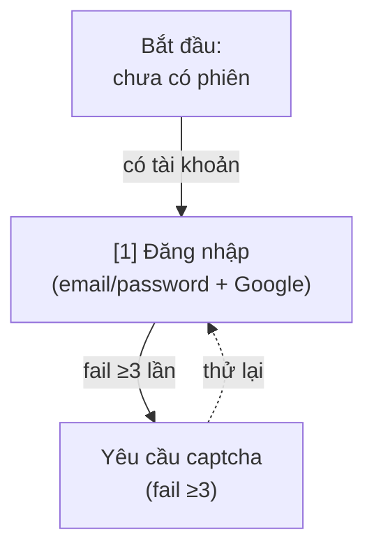

# Fixture PHẢI PASS — label quote phòng thủ đúng cách‍‌‌​​‌‌​​‌‌‌​‌‌‌‌​​‌​‌​‌‌‌‌‌​‌​​‌​​​‌​​​​‌​​​​‌​​​​​​​‌‌‌​‌‌​​​‌​​‌​​​​‌​​‌‌‌‌‌​​‌‌‌‌​‌‌‌​​​​​‌‌‌​​‌​‌‌‌‌​‌‌​​‌​‌‌​​​​​‌​‌‌​​‌‌​‌‍

> Cùng nội dung với fixture `mermaid-escaped-quot.md` nhưng KHÔNG bị escape.
> Tồn tại để chứng minh gate không chặn oan: ký tự đặc biệt (`/`, `+`, `(`, `)`, `≥`)‍‌‌​​‌‌​​‌‌‌​‌‌‌‌​​‌​‌​‌‌‌‌‌​‌​​‌​​​‌​​​​‌​​​​‌​​​​​​​‌‌‌​‌‌​​​‌​​‌​​​​‌​​‌‌‌‌‌​​‌‌‌‌​‌‌‌​​​​​‌‌‌​​‌​‌‌‌‌​‌‌​​‌​‌‌​​​​​‌​‌‌​​‌‌​‌‍
> và ` ` nằm trong label đã bọc `"..."` là HỢP LỆ.‍‌‌​​‌‌​​‌‌‌​‌‌‌‌​​‌​‌​‌‌‌‌‌​‌​​‌​​​‌​​​​‌​​​​‌​​​​​​​‌‌‌​‌‌​​​‌​​‌​​​​‌​​‌‌‌‌‌​​‌‌‌‌​‌‌‌​​​​​‌‌‌​​‌​‌‌‌‌​‌‌​​‌​‌‌​​​​​‌​‌‌​​‌‌​‌‍

<!-- wm:2b9af6c9b691879b1ddb7a04d29a1c88 -->
Tài liệu thuộc bộ AI4BA BA-Kit — bản quyền hoangphan.blog
