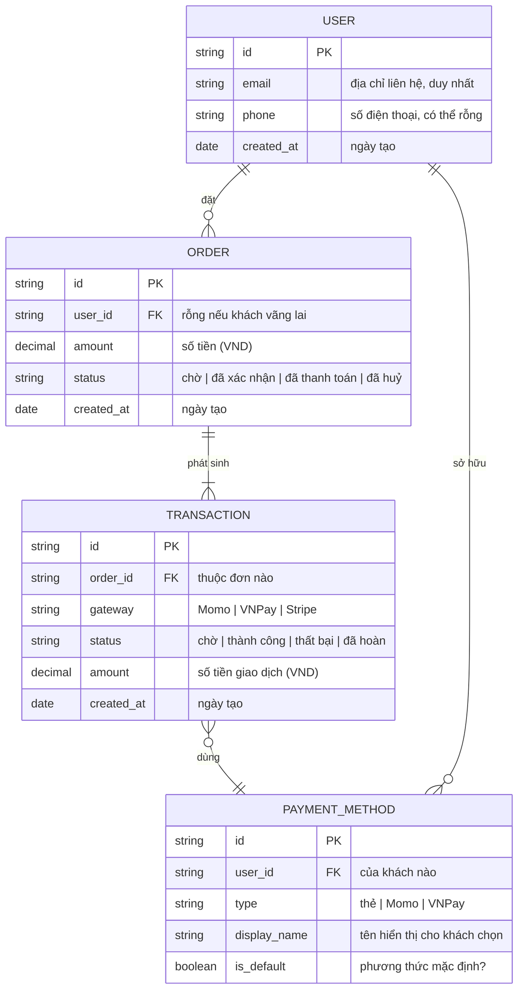

<!-- Licensed to nguyenhoangdao777@gmail.com — Order YYWVQ3VWE -->

# /erd — Mermaid Entity-Relationship Diagram‍‌‌​​‌‌​​‌‌‌​‌‌‌‌​​‌​‌​‌‌‌‌‌​‌​​‌​​​‌​​​​‌​​​​‌​​​​​​​‌‌‌​‌‌​​​‌​​‌​​​​‌​​‌‌‌‌‌​​‌‌‌‌​‌‌‌​​​​​‌‌‌​​‌​‌‌‌‌​‌‌​​‌​‌‌​​​​​‌​‌‌​​‌‌​‌‍

## Goal‍‌‌​​‌‌​​‌‌‌​‌‌‌‌​​‌​‌​‌‌‌‌‌​‌​​‌​​​‌​​​​‌​​​​‌​​​​​​​‌‌‌​‌‌​​​‌​​‌​​​​‌​​‌‌‌‌‌​​‌‌‌‌​‌‌‌​​​​​‌‌‌​​‌​‌‌‌‌​‌‌​​‌​‌‌​​​​​‌​‌‌​​‌‌​‌‍

Tạo Mermaid `erDiagram` cho data model per-feature. __Output duy nhất__: `docs/{feature}/srs/{feature}-erd.md`. Project-wide ERD đã bỏ (singleton exception cũ) — nếu cross-feature data view cần, user tự gom manually.

## Constraints‍‌‌​​‌‌​​‌‌‌​‌‌‌‌​​‌​‌​‌‌‌‌‌​‌​​‌​​​‌​​​​‌​​​​‌​​​​​​​‌‌‌​‌‌​​​‌​​‌​​​​‌​​‌‌‌‌‌​​‌‌‌‌​‌‌‌​​​​​‌‌‌​​‌​‌‌‌‌​‌‌​​‌​‌‌​​​​​‌​‌‌​​‌‌​‌‍

### Hard rules — never violate‍‌‌​​‌‌​​‌‌‌​‌‌‌‌​​‌​‌​‌‌‌‌‌​‌​​‌​​​‌​​​​‌​​​​‌​​​​​​​‌‌‌​‌‌​​​‌​​‌​​​​‌​​‌‌‌‌‌​​‌‌‌‌​‌‌‌​​​​​‌‌‌​​‌​‌‌‌‌​‌‌​​‌​‌‌​​​​​‌​‌‌​​‌‌​‌‍

- __1 output cố định__ — `docs/{feature}/srs/{feature}-erd.md`. KHÔNG flag `--scope project`.
- __L1 approval__ trước Write.
- __KHÔNG L3 iterate__ — mermaid không render trong chat nên iterate vô nghĩa. Đi thẳng L1 plan → Write. User review ERD đã render từ file (IDE/Obsidian/GitHub) → muốn sửa thì gọi lại skill và nói cần đổi gì.
- **`--feature` optional** — auto-detect từ ngữ cảnh/feature đang làm dở; mơ hồ mới hỏi bằng picker. __Feature chưa tồn tại + arg là mô tả data model → tự derive slug + tạo feature__ (điểm-vào, xem `feature-bootstrap.md` nhóm A). KHÔNG bắt qua `/brainstorm` trước.
- __File đã tồn tại__ → tự động chuyển sang update mode (L2 diff), không refuse.
- __Auto-detect entities__ từ SRS Mục 6 nếu có.
- __Vietnamese-first__ trong description; mermaid keywords English.
- __ERD được phép kỹ thuật — type/PK/FK là bản chất, KHÔNG phải lệch vai.__ Rule no-dev của vault (`ba-conventions.md` Mục 3) nhắm vào việc *phỏng vấn* user bằng ngôn ngữ DB ("varchar hay text?") và thứ over-detail (index, migration, denormalization, token PCI, `jsonb`/`uuid`/`varchar(255)`) — KHÔNG cấm type kỹ thuật gọn trên chính ERD.
  - __Type dùng:__ `string` / `int` / `decimal` / `date` / `datetime` / `boolean`.
  - Comment (`"..."`) mới là chỗ ghi nghĩa nghiệp vụ tiếng Việt + enum values.
  - __KHÔNG dùng__ `uuid`/`jsonb`/`varchar(255)`, KHÔNG mục "Indexes cần plan", KHÔNG note PCI/encryption — đó là việc dev/DBA ở `/srs`, không phải ERD nghiệp vụ.

### Pitfalls — easy to get wrong‍‌‌​​‌‌​​‌‌‌​‌‌‌‌​​‌​‌​‌‌‌‌‌​‌​​‌​​​‌​​​​‌​​​​‌​​​​​​​‌‌‌​‌‌​​​‌​​‌​​​​‌​​‌‌‌‌‌​​‌‌‌‌​‌‌‌​​​​​‌‌‌​​‌​‌‌‌‌​‌‌​​‌​‌‌​​​​​‌​‌‌​​‌‌​‌‍

- **Mỗi attribute BẮT BUỘC đúng 2 token `type name`** (+comment optional). Chỉ ghi `name` (bỏ type) → parse fail `Expecting 'ATTRIBUTE_WORD', got 'ATTRIBUTE_KEY'`. Nên PK phải là `string id PK`, không phải `id PK`. Đừng thử bỏ cột type để "cho nghiệp vụ" — Mermaid không cho. Type gọn (`string`/`decimal`/`date`) là đủ.
- __Cột type đừng lặp dại__ — `string id` OK, nhưng `id id` (đặt cả type lẫn name = `id`) đọc rất ngớ ngẩn. Bước 9.5 tự-xem-ảnh bắt lỗi này.
- __Cardinality tricky__ — nhớ thứ tự: `LEFT ||--o{ RIGHT` đọc là "1 LEFT có nhiều RIGHT". Đừng nhầm direction.
- __Self-reference cần label__ — `EMPLOYEE ||--o{ EMPLOYEE : "manages"` để render OK.
- __Inheritance không native__ — Mermaid `erDiagram` không full support inheritance, không có syntax cho "Admin extends User". Workaround: tạo entity ADMIN với FK `user_id` trỏ USER + note "ISA relationship via FK". Document trong Mục Notes.
- __Self-referential many-to-many__ (vd "friends" giữa Users) — dùng junction entity: `USER ||--o{ FRIENDSHIP }o--|| USER`. Mermaid không vẽ trực tiếp được m:n loop.
- __Long entity names__ — render xấu nếu >15 chars. Abbreviate: `PAYMENT_METHOD` → `PMT_METHOD` (note full name trong Mục Entity Reference).
- __PK/FK markers optional__ nhưng nên có cho audit/migration planning.
- __Composite PK__ — Mermaid không render rõ. Note: `(user_id, role_id) PK` trong attribute description.
- __Soft-deleted column convention__ — `deleted_at timestamp "nullable, soft-delete"`.
- __Update mode__ với new entities → preserve existing layout, add new entities sau cuối block.
- __Mermaid syntax fail__ — bước 9.5 bắt lỗi qua `mermaid-verify.mjs` NGAY sau Write, tự sửa tối đa 2 lần. KHÔNG write rồi bỏ mặc — chỉ báo user paste mermaid.live nếu 2 lần tự sửa vẫn fail.

## Inputs

```
/erd --feature <slug>       # tạo mới, hoặc tự vào update mode nếu erd.md đã tồn tại
/erd                        # feature auto-detect từ ngữ cảnh, mơ hồ mới hỏi
/erd "<mô tả data model của feature mới>"   # feature chưa có → derive slug + phỏng vấn + tạo feature (nhóm A)
```

Muốn dùng entity descriptions từ nguồn khác thay vì trả lời trực tiếp → tag `@file` hoặc dán nội dung trong câu chat.

## Context (dynamic)

Today: !`date +%Y-%m-%d`
Features có SRS: !`for d in docs/*/srs/*-spec.md; do [ -f "$d" ] && dirname "$d" | xargs dirname | xargs basename; done | head -20`
Features có ERD: !`for d in docs/*/srs/*-erd.md; do [ -f "$d" ] && grep -l "erDiagram" "$d" 2>/dev/null && dirname "$d" | xargs dirname | xargs basename; done | head -10`

## Approach

1. __Resolve feature.__ `--feature` explicit nếu có; else auto-detect (single in-progress) hoặc prompt picker.
   - **Feature chưa tồn tại (điểm-vào, per `feature-bootstrap.md` nhóm A):** nếu arg là 1 mô tả data model thô mà chưa có `docs/{feature}/` nào khớp (vd `/erd "khách hàng, đơn hàng, giao dịch thanh toán"`) → `/erd` ĐƯỢC PHÉP tự khởi tạo: derive feature slug từ mô tả (kebab-case, ASCII, ≤50 ký tự), confirm slug ở L1 (user override được), tạo `docs/{feature}/srs/` khi Write. KHÔNG bắt user chạy `/brainstorm` trước.
2. __Validate existing.__ `erd.md` đã tồn tại → tự chuyển sang update mode (L2 diff), báo user biết đang update.
3. __Auto-detect upstream entities__ — scan `docs/{feature}/srs/{feature}-spec.md` Mục 6 Data Entities bullet list. Có → dùng, không hỏi lại cái đã có (no-re-ask).
4. __Phỏng vấn ĐÚNG PHẠM VI erd cần__ (khi chưa có nguồn — feature mới hoặc cũ thiếu spec.md, per `feature-bootstrap.md` nhóm A bước 3). Hỏi gom 1 batch business-language, __KHÔNG hỏi kiểu DB__ (varchar/int...) — chỉ nghĩa nghiệp vụ của attribute:
   1. Liệt kê __entities__ chính (1 dòng/entity: name + 1-sentence purpose).
   2. __Attribute nghiệp vụ__ của từng entity (tên + nghĩa, vd "email — địa chỉ liên hệ", "status — trạng thái đơn"; PK/FK marker nếu rõ). __KHÔNG hỏi kiểu dữ liệu DB__ ("varchar hay text?" là câu của dev) — skill TỰ gán type kỹ thuật gọn (`string`/`int`/`decimal`/`date`/`boolean`) khi vẽ, vì ERD vốn là artifact kỹ thuật (xem Pitfalls). User chỉ mô tả nghĩa nghiệp vụ.
   3. __Quan hệ__ giữa entities (cardinality 1:1 / 1:N / N:N + label mô tả bản chất quan hệ).
   4. Inheritance/specialization (nếu có) — Mermaid limitation flag.
4.5. __Mô tả mơ hồ dù có nguồn__ (vd `spec.md` Mục 6 chỉ liệt kê tên entity mà không rõ attribute/quan hệ, hoặc mô tả user gõ quá ngắn) → __PHẢI hỏi clarifying trước khi generate__, KHÔNG tự bịa attribute/cardinality. Câu hỏi tối thiểu: "Entity {X} có những attribute nghiệp vụ nào?", "Quan hệ giữa {X} và {Y} là 1:1, 1:N hay N:N?".
5. **Generate Mermaid `erDiagram`:**‍‌‌​​‌‌​​‌‌‌​‌‌‌‌​​‌​‌​‌‌‌‌‌​‌​​‌​​​‌​​​​‌​​​​‌​​​​​​​‌‌‌​‌‌​​​‌​​‌​​​​‌​​‌‌‌‌‌​​‌‌‌‌​‌‌‌​​​​​‌‌‌​​‌​‌‌‌‌​‌‌​​‌​‌‌​​​​​‌​‌‌​​‌‌​‌‍
   - UPPERCASE entity names (convention).
   - Attributes inside `{}` block: `type name [PK|FK]`.
   - Relationships: `||--o{` (one-to-many), `||--||` (one-to-one), `}o--o{` (many-to-many).
   - Self-reference: `ENTITY ||--o{ ENTITY : "label"`.
6. __L1 approval__ plan table — show path + tóm tắt entity/relationship count. __KHÔNG L3 iterate trong chat__ — mermaid không render được trong chat, review từ rendered file hiệu quả hơn.
7. __Write__ từ `_templates/diagram-erd.md` (slim frontmatter `type: srs-erd`/`feature`/`updated`). Fill `mermaid_code`, `entity_descriptions`, `notes`.
8. __Update mode (file đã tồn tại)__ → L2 diff. Update `updated: {date}`.
9. __Activity log__ — set env `CLAUDE_SKILL_NAME=/erd` + `CLAUDE_CHANGELOG_NOTE` (note: `{N} entities, {M} relationships — {note}`) TRƯỚC khi Write — hook append vào `docs/_shared/changelog.md` (không phụ thuộc spec.md tồn tại hay chưa, không còn routing/fallback). Update erd.md `updated: {date}`.
9.5. __Render-verify + TỰ XEM ẢNH (BẮT BUỘC, chạy ngay sau Write)__ — `node .claude/scripts/mermaid-verify.mjs --file docs/{feature}/srs/{feature}-erd.md --png <scratchpad>/erd-review`. Cờ `--png` vừa compile-check vừa xuất ảnh PNG mỗi block để skill __tự Read xem hình__. Mermaid không render trong chat (đây là lý do skip L3), nên đây là cách duy nhất bắt lỗi TRƯỚC khi báo "xong".
   - Script chạy __3 tầng, báo tách riêng__: cú pháp compile · nhãn an toàn renderer · __ngữ nghĩa__.
     Tầng ngữ nghĩa cho ERD bắt: __entity ma__ (tên trong quan hệ nhưng không có khối thuộc tính —
     typo làm mermaid vẽ box rỗng, __error__); __quan hệ không có FK chống lưng__ (__cảnh báo__);
     nhãn nói "có thể/tối đa" mà ký hiệu lại bắt buộc, nhãn nói "nhiều" mà ký hiệu không `{`
     (__cảnh báo__); N:N trực tiếp thiếu bảng trung gian (__cảnh báo__).
   - __Cảnh báo "không thấy cột FK tương ứng" phải xử lý, đừng lướt__: hoặc thêm cột FK vào entity
     con, hoặc XÓA quan hệ thừa. Quan hệ không có FK là nguồn drift khi `/d2-erd` + `/dbdiagram`
     sinh lại từ file này (đo thật: `USER ||--o{ PAYMENT_METHOD` tồn tại ở Mermaid nhưng mất ở D2).
   - Còn `error` → sửa rồi chạy lại (tối đa 2 vòng). KHÔNG báo "xong" khi vẫn còn error.
   - __Compile fail__ (thường do attribute thiếu token type — xem Pitfalls "2-token" — hoặc relationship label thiếu quote) → đọc lỗi dòng/cột script trả về, sửa lại block vừa ghi, verify lại. Tối đa 2 lần tự sửa.
   - __Compile pass__ → __Read ảnh PNG__ (`<scratchpad>/erd-review/block-0.png`) và TỰ SOI nghiệp vụ (compile-check KHÔNG bắt được lỗi nội dung):
     - [ ] Đủ entity? Không thiếu entity nào có trong nguồn/mô tả.
     - [ ] Cardinality đúng chiều? `USER ||--o{ ORDER` = 1 user có nhiều order — đừng vẽ ngược.
     - [ ] Cột type không lặp dại (vd `id id`)? Type kỹ thuật gọn, name có nghĩa.
     - [ ] Nhãn quan hệ đọc được, không bị wrap dài che hình.
     - Lỗi bất kỳ → sửa .md, re-render + re-xem. Tối đa 2 vòng.
   - __Vẫn fail sau 2 lần__ → báo user rõ lỗi cụ thể + đoạn mermaid, gợi ý paste mermaid.live để debug tay. KHÔNG âm thầm để file lỗi/xấu mà báo "xong" bình thường.
9.6. __Nếu feature ĐÃ có bản phái sinh__ (`d2-erd/{feature}.d2` hoặc `dbdiagram/{feature}.dbml`) —
   chạy `node .claude/scripts/erd-consistency.mjs --feature {slug}`. File này là __canonical__, nên
   mỗi lần sửa nó là các bản kia thành lỗi thời. Có lệch → báo user + đề xuất chạy lại `/d2-erd`
   và/hoặc `/dbdiagram`. Chưa có bản phái sinh → script tự báo "không có gì lệch", bỏ qua.
10. __Output report:__
   ```
   ✅ ERD đã ghi: docs/{feature}/srs/{feature}-erd.md
      Entities: {N} | Relationships: {M} | Mermaid compile: OK

   Mở file trong IDE/Obsidian/GitHub preview để xem rendered diagram.
   Cần sửa? Gọi lại /erd --feature {feature}, em tự vào update mode.
   ```

## Output

`docs/{feature}/srs/{feature}-erd.md` — Mermaid `erDiagram`. Slim frontmatter (`type: srs-erd` / `feature` / `updated`), ghi từ `_templates/diagram-erd.md`.

Hook `auto-changelog.sh` tự ghi 1 dòng vào `docs/_shared/changelog.md`.

## Mermaid syntax reference



> __Type__ = kỹ thuật gọn (`string`/`int`/`decimal`/`date`/`datetime`/`boolean`). **Comment `"..."`** = nghĩa nghiệp vụ tiếng Việt + liệt kê enum. KHÔNG `uuid`/`jsonb`/`varchar(255)`, KHÔNG index/token PCI (việc dev ở `/srs`).

## References

- @../../rules/ba-conventions.md
- @../../rules/approval-gate.md
- @../../rules/naming-conventions.md
- @../../rules/changelog.md
- @../../rules/diagram-selection.md
- @../../rules/diagram-correctness.md
- @../../rules/feature-bootstrap.md
- @../../../_templates/diagram-erd.md
- @./references/example-erd.md
- @../../scripts/mermaid-verify.mjs (render-verify sau Write — bước 9.5)‍‌‌​​‌‌​​‌‌‌​‌‌‌‌​​‌​‌​‌‌‌‌‌​‌​​‌​​​‌​​​​‌​​​​‌​​​​​​​‌‌‌​‌‌​​​‌​​‌​​​​‌​​‌‌‌‌‌​​‌‌‌‌​‌‌‌​​​​​‌‌‌​​‌​‌‌‌‌​‌‌​​‌​‌‌​​​​​‌​‌‌​​‌‌​‌‍


<!-- wm:2b9af6c9b691879b1ddb7a04d29a1c88 -->
<sub>Tài liệu thuộc bộ AI4BA BA-Kit — bản quyền hoangphan.blog</sub>
