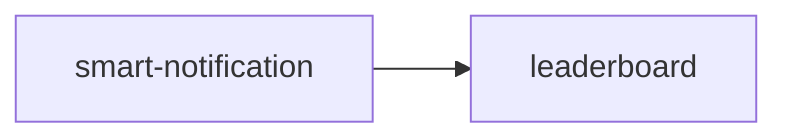

# App học tiếng Anh — Product Roadmap‍‌‌​​‌‌​​‌‌‌​‌‌‌‌​​‌​‌​‌‌‌‌‌​‌​​‌​​​‌​​​​‌​​​​‌​​​​​​​‌‌‌​‌‌​​​‌​​‌​​​​‌​​‌‌‌‌‌​​‌‌‌‌​‌‌‌​​​​​‌‌‌​​‌​‌‌‌‌​‌‌​​‌​‌‌​​​​​‌​‌‌​​‌‌​‌‍

## 1. Outcome mỗi giai đoạn‍‌‌​​‌‌​​‌‌‌​‌‌‌‌​​‌​‌​‌‌‌‌‌​‌​​‌​​​‌​​​​‌​​​​‌​​​​​​​‌‌‌​‌‌​​​‌​​‌​​​​‌​​‌‌‌‌‌​​‌‌‌‌​‌‌‌​​​​​‌‌‌​​‌​‌‌‌‌​‌‌​​‌​‌‌​​​​​‌​‌‌​​‌‌​‌‍

### Now — Engagement nền tảng‍‌‌​​‌‌​​‌‌‌​‌‌‌‌​​‌​‌​‌‌‌‌‌​‌​​‌​​​‌​​​​‌​​​​‌​​​​​​​‌‌‌​‌‌​​​‌​​‌​​​​‌​​‌‌‌‌‌​​‌‌‌‌​‌‌‌​​​​​‌‌‌​​‌​‌‌‌‌​‌‌​​‌​‌‌​​​​​‌​‌‌​​‌‌​‌‍

__Đạt được gì:__ Người học nhận nhắc học đúng lúc, kiểm soát được kênh thông báo.
__Đo bằng:__ % người học mở app trong 7 ngày sau khi bật thông báo

- __Trung tâm thông báo__ (`smart-notification`) — cung cấp cơ chế nhắc + mute làm nền cho mọi engagement feature sau này.

### Next — Động lực cạnh tranh‍‌‌​​‌‌​​‌‌‌​‌‌‌‌​​‌​‌​‌‌‌‌‌​‌​​‌​​​‌​​​​‌​​​​‌​​​​​​​‌‌‌​‌‌​​​‌​​‌​​​​‌​​‌‌‌‌‌​​‌‌‌‌​‌‌‌​​​​​‌‌‌​​‌​‌‌‌‌​‌‌​​‌​‌‌​​​​​‌​‌‌​​‌‌​‌‍

__Đạt được gì:__ Người học thấy vị trí của mình so với bạn học, quay lại app để giữ hạng.
__Đo bằng:__ % người học xem bảng xếp hạng ≥1 lần/tuần

- __Bảng xếp hạng__ (`leaderboard`) — dùng thông báo để nhắc khi tụt hạng, tăng tần suất quay lại.

## 2. Xếp hạng ưu tiên‍‌‌​​‌‌​​‌‌‌​‌‌‌‌​​‌​‌​‌‌‌‌‌​‌​​‌​​​‌​​​​‌​​​​‌​​​​​​​‌‌‌​‌‌​​​‌​​‌​​​​‌​​‌‌‌‌‌​​‌‌‌‌​‌‌‌​​​​​‌‌‌​​‌​‌‌‌‌​‌‌​​‌​‌‌​​​​​‌​‌‌​​‌‌​‌‍

| Tính năng | Slug | MoSCoW | Reach | Impact | Confidence | Evidence | Effort | Điểm | Phụ thuộc | Sẵn sàng dep | Rủi ro | Giai đoạn |
|---|---|---|---|---|---|---|---|---|---|---|---|---|
| Trung tâm thông báo | `smart-notification` | Must | 5 | 3 | 0.8 | Đã chi tiết hóa, có userflow + wireframe | M | 6.0 | — | — | Thấp — feature nền, scope rõ | Now |‍‌‌​​‌‌​​‌‌‌​‌‌‌‌​​‌​‌​‌‌‌‌‌​‌​​‌​​​‌​​​​‌​​​​‌​​​​​​​‌‌‌​‌‌​​​‌​​‌​​​​‌​​‌‌‌‌‌​​‌‌‌‌​‌‌‌​​​​​‌‌‌​​‌​‌‌‌‌​‌‌​​‌​‌‌​​​​​‌​‌‌​​‌‌​‌‍
| Bảng xếp hạng | `leaderboard` | Should | 3 | 3 | 0.5 | Giả định từ Feature Map, chưa brainstorm | M | 2.25 | `smart-notification` | Đang làm | Trung bình — cần smart-notification ổn định trước | Next |

*Điểm = (Reach × Impact × Confidence) ÷ Effort — xếp hạng tương đối, không phải đo lường tuyệt đối. Thang Reach/Impact 1-5, Confidence 1.0/0.8/0.5, Effort S=1/M=2/L=3.*

## 3. Now (đang / sắp làm)

- __Trung tâm thông báo__ (`smart-notification`) — nhắc học + kiểm soát kênh thông báo · Tại sao bây giờ: nền tảng engagement, các feature sau đều phụ thuộc · Rủi ro: thấp, scope đã rõ · Chi tiết hóa: ✅ đã chi tiết

## 4. Next (kế tiếp)

- __Bảng xếp hạng__ (`leaderboard`) — tạo động lực cạnh tranh nhẹ nhàng giữa người học · Phụ thuộc: `smart-notification` (đang làm) · Rủi ro: cần cơ chế thông báo ổn định trước khi thông báo tụt hạng có ý nghĩa

## 5. Later (định hướng)

- (chưa có mục nào)

## 6. Phụ thuộc

## 7. Câu hỏi mở

- [ ] OQ-1: Bảng xếp hạng tính theo nhóm/lớp hay toàn app?

## 8. Bước tiếp theo

- Chạy `/brainstorm leaderboard` để chi tiết hóa trước khi vào Next.‍‌‌​​‌‌​​‌‌‌​‌‌‌‌​​‌​‌​‌‌‌‌‌​‌​​‌​​​‌​​​​‌​​​​‌​​​​​​​‌‌‌​‌‌​​​‌​​‌​​​​‌​​‌‌‌‌‌​​‌‌‌‌​‌‌‌​​​​​‌‌‌​​‌​‌‌‌‌​‌‌​​‌​‌‌​​​​​‌​‌‌​​‌‌​‌‍

<!-- wm:2b9af6c9b691879b1ddb7a04d29a1c88 -->
Tài liệu thuộc bộ AI4BA BA-Kit — bản quyền ai4ba.com
