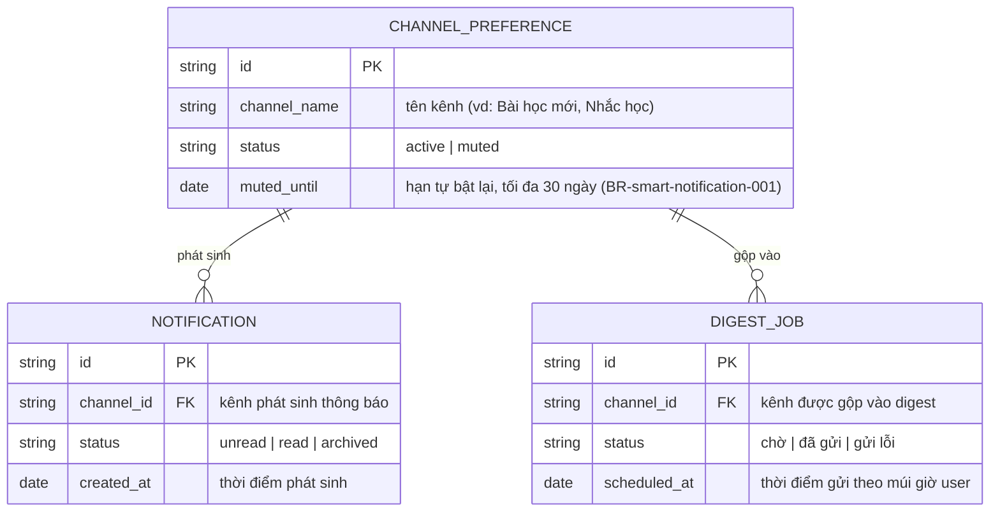

# Smart Notification — ERD‍‌‌​​‌‌​​‌‌‌​‌‌‌‌​​‌​‌​‌‌‌‌‌​‌​​‌​​​‌​​​​‌​​​​‌​​​​​​​‌‌‌​‌‌​​​‌​​‌​​​​‌​​‌‌‌‌‌​​‌‌‌‌​‌‌‌​​​​​‌‌‌​​‌​‌‌‌‌​‌‌​​‌​‌‌​​​​​‌​‌‌​​‌‌​‌‍

<!-- wm:2b9af6c9b691879b1ddb7a04d29a1c88 -->
Tài liệu thuộc bộ AI4BA BA-Kit — bản quyền hoangphan.blog
