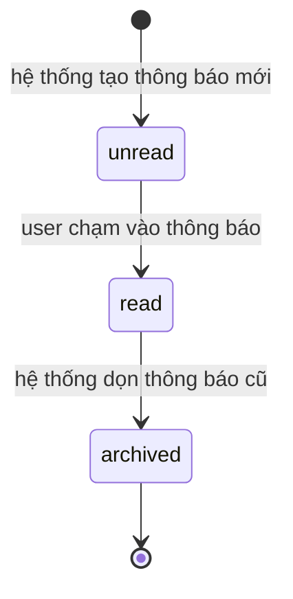
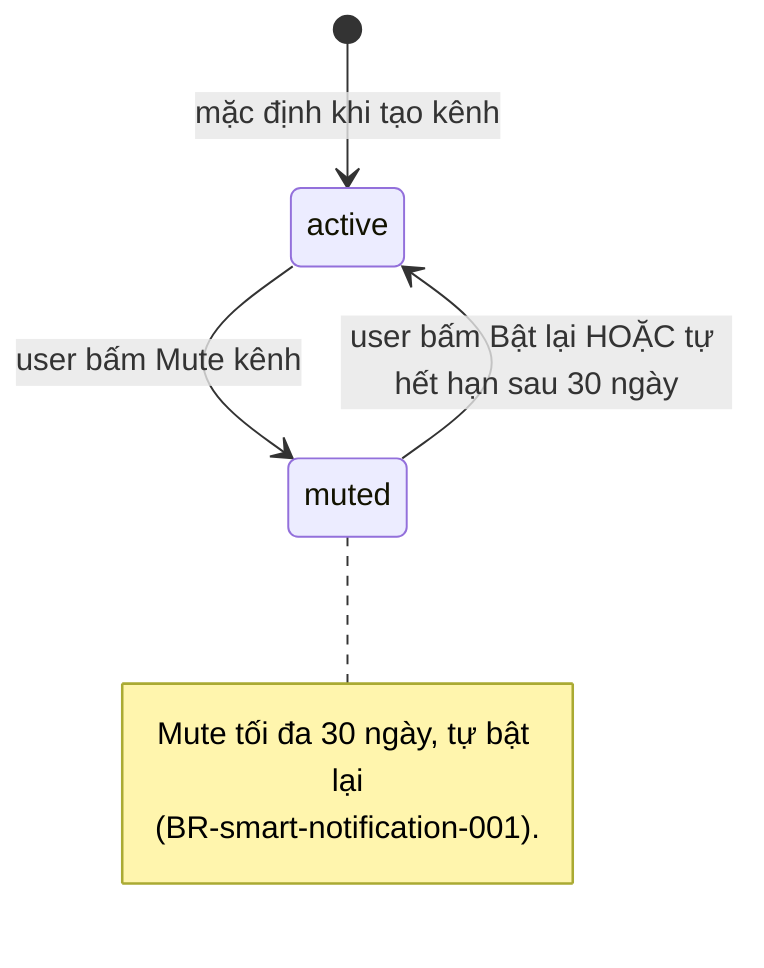

# Smart Notification — States‍‌‌​​‌‌​​‌‌‌​‌‌‌‌​​‌​‌​‌‌‌‌‌​‌​​‌​​​‌​​​​‌​​​​‌​​​​​​​‌‌‌​‌‌​​​‌​​‌​​​​‌​​‌‌‌‌‌​​‌‌‌‌​‌‌‌​​​​​‌‌‌​​‌​‌‌‌‌​‌‌​​‌​‌‌​​​​​‌​‌‌​​‌‌​‌‍

## State: Notification‍‌‌​​‌‌​​‌‌‌​‌‌‌‌​​‌​‌​‌‌‌‌‌​‌​​‌​​​‌​​​​‌​​​​‌​​​​​​​‌‌‌​‌‌​​​‌​​‌​​​​‌​​‌‌‌‌‌​​‌‌‌‌​‌‌‌​​​​​‌‌‌​​‌​‌‌‌‌​‌‌​​‌​‌‌​​​​​‌​‌‌​​‌‌​‌‍
__Related entity__: Notification (CamelCase khớp ERD `srs/smart-notification-erd.md`)
__Related UC__: [[../usecases/uc-view-notifications.md]]
__Related BR__: BR-smart-notification-002

### Invalid transitions‍‌‌​​‌‌​​‌‌‌​‌‌‌‌​​‌​‌​‌‌‌‌‌​‌​​‌​​​‌​​​​‌​​​​‌​​​​​​​‌‌‌​‌‌​​​‌​​‌​​​​‌​​‌‌‌‌‌​​‌‌‌‌​‌‌‌​​​​​‌‌‌​​‌​‌‌‌‌​‌‌​​‌​‌‌​​​​​‌​‌‌​​‌‌​‌‍

| From | To | Why not |
|---|---|---|
| archived | unread | Thông báo đã lưu trữ không quay lại chưa đọc |
| archived | read | Thông báo đã lưu trữ không cần đánh dấu đọc lại |‍‌‌​​‌‌​​‌‌‌​‌‌‌‌​​‌​‌​‌‌‌‌‌​‌​​‌​​​‌​​​​‌​​​​‌​​​​​​​‌‌‌​‌‌​​​‌​​‌​​​​‌​​‌‌‌‌‌​​‌‌‌‌​‌‌‌​​​​​‌‌‌​​‌​‌‌‌‌​‌‌​​‌​‌‌​​​​​‌​‌‌​​‌‌​‌‍

## State: ChannelPreference‍‌‌​​‌‌​​‌‌‌​‌‌‌‌​​‌​‌​‌‌‌‌‌​‌​​‌​​​‌​​​​‌​​​​‌​​​​​​​‌‌‌​‌‌​​​‌​​‌​​​​‌​​‌‌‌‌‌​​‌‌‌‌​‌‌‌​​​​​‌‌‌​​‌​‌‌‌‌​‌‌​​‌​‌‌​​​​​‌​‌‌​​‌‌​‌‍
__Related entity__: ChannelPreference (CamelCase khớp ERD `srs/smart-notification-erd.md`)
__Related UC__: [[../usecases/uc-mute-channel.md]]
__Related BR__: BR-smart-notification-001

### Invalid transitions‍‌‌​​‌‌​​‌‌‌​‌‌‌‌​​‌​‌​‌‌‌‌‌​‌​​‌​​​‌​​​​‌​​​​‌​​​​​​​‌‌‌​‌‌​​​‌​​‌​​​​‌​​‌‌‌‌‌​​‌‌‌‌​‌‌‌​​​​​‌‌‌​​‌​‌‌‌‌​‌‌​​‌​‌‌​​​​​‌​‌‌​​‌‌​‌‍

| From | To | Why not |
|---|---|---|
| muted | muted | Mute lại kênh đang mute không tạo transition mới, chỉ gia hạn thời điểm hết hạn |‍‌‌​​‌‌​​‌‌‌​‌‌‌‌​​‌​‌​‌‌‌‌‌​‌​​‌​​​‌​​​​‌​​​​‌​​​​​​​‌‌‌​‌‌​​​‌​​‌​​​​‌​​‌‌‌‌‌​​‌‌‌‌​‌‌‌​​​​​‌‌‌​​‌​‌‌‌‌​‌‌​​‌​‌‌​​​​​‌​‌‌​​‌‌​‌‍

<!-- wm:2b9af6c9b691879b1ddb7a04d29a1c88 -->
Tài liệu thuộc bộ AI4BA BA-Kit — bản quyền ai4ba.com
