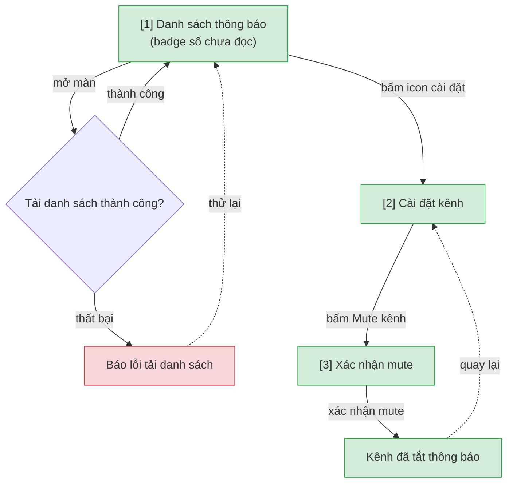

# Smart Notification — User Flow‍‌‌​​‌‌​​‌‌‌​‌‌‌‌​​‌​‌​‌‌‌‌‌​‌​​‌​​​‌​​​​‌​​​​‌​​​​​​​‌‌‌​‌‌​​​‌​​‌​​​​‌​​‌‌‌‌‌​​‌‌‌‌​‌‌‌​​​​​‌‌‌​​‌​‌‌‌‌​‌‌​​‌​‌‌​​​​​‌​‌‌​​‌‌​‌‍

> Nguồn chia flow DUY NHẤT cho feature này. `/wireframe-ascii` và `/wireframe-html` đọc file này để biết flow nào gồm những màn nào — KHÔNG tự chia flow riêng.

## 1. User Flow (tổng)‍‌‌​​‌‌​​‌‌‌​‌‌‌‌​​‌​‌​‌‌‌‌‌​‌​​‌​​​‌​​​​‌​​​​‌​​​​​​​‌‌‌​‌‌​​​‌​​‌​​​​‌​​‌‌‌‌‌​​‌‌‌‌​‌‌‌​​​​​‌‌‌​​‌​‌‌‌‌​‌‌​​‌​‌‌​​​​​‌​‌‌​​‌‌​‌‍

> Phủ happy / error / edge cases. `[n]` = số màn hình đối chiếu Mục 2.

## 2. Danh sách màn hình‍‌‌​​‌‌​​‌‌‌​‌‌‌‌​​‌​‌​‌‌‌‌‌​‌​​‌​​​‌​​​​‌​​​​‌​​​​​​​‌‌‌​‌‌​​​‌​​‌​​​​‌​​‌‌‌‌‌​​‌‌‌‌​‌‌‌​​​​​‌‌‌​​‌​‌‌‌‌​‌‌​​‌​‌‌​​​​​‌​‌‌​​‌‌​‌‍

| [#] | Slug | Màn hình | Mục đích | Thuộc flow |
|-----|------|----------|----------|------------|
| 1 | notification-list | Danh sách thông báo | Xem toàn bộ thông báo + badge số chưa đọc, đánh dấu đã đọc | view-notifications |
| 2 | notification-settings | Cài đặt kênh | Chọn kênh muốn mute thông báo | mute-channel |
| 3 | mute-confirm | Xác nhận mute | Xác nhận trước khi tắt thông báo 1 kênh | mute-channel |

## 3. Danh sách flow‍‌‌​​‌‌​​‌‌‌​‌‌‌‌​​‌​‌​‌‌‌‌‌​‌​​‌​​​‌​​​​‌​​​​‌​​​​​​​‌‌‌​‌‌​​​‌​​‌​​​​‌​​‌‌‌‌‌​​‌‌‌‌​‌‌‌​​​​​‌‌‌​​‌​‌‌‌‌​‌‌​​‌​‌‌​​​​​‌​‌‌​​‌‌​‌‍

| Flow-slug | Tên flow | Màn hình gồm | Cases phủ |
|-----------|----------|--------------|-----------|‍‌‌​​‌‌​​‌‌‌​‌‌‌‌​​‌​‌​‌‌‌‌‌​‌​​‌​​​‌​​​​‌​​​​‌​​​​​​​‌‌‌​‌‌​​​‌​​‌​​​​‌​​‌‌‌‌‌​​‌‌‌‌​‌‌‌​​​​​‌‌‌​​‌​‌‌‌‌​‌‌​​‌​‌‌​​​​​‌​‌‌​​‌‌​‌‍
| view-notifications | Xem thông báo | notification-list | happy, error (tải danh sách thất bại) |
| mute-channel | Mute kênh | notification-settings → mute-confirm | happy, edge (mute rồi bật lại) |

## 3.5. Chuyển màn (transitions)‍‌‌​​‌‌​​‌‌‌​‌‌‌‌​​‌​‌​‌‌‌‌‌​‌​​‌​​​‌​​​​‌​​​​‌​​​​​​​‌‌‌​‌‌​​​‌​​‌​​​​‌​​‌‌‌‌‌​​‌‌‌‌​‌‌‌​​​​​‌‌‌​​‌​‌‌‌‌​‌‌​​‌​‌‌​​​​​‌​‌‌​​‌‌​‌‍

> Nguồn DUY NHẤT cho chuyển màn màn→màn (edge NAVIGATES_TO). `/wireframe-html` + `/prototype-html` đọc bảng này để nối nút/điều hướng — KHÔNG tự suy lại từ prose/mermaid (tránh 3 nơi maintain lệch nhau). 1 dòng = 1 chuyển; đủ phủ happy + error + edge của Mục 1.

| Từ màn [#] | Đến màn [#] | Trigger | Điều kiện |
|-----------|------------|---------|-----------|
| Danh sách thông báo [1] | Cài đặt kênh [2] | Bấm icon cài đặt | — |
| Cài đặt kênh [2] | Xác nhận mute [3] | Bấm Mute kênh | — |

## 4. Open Questions

- [ ] OQ-1: Digest email có gửi lại thông báo đã đọc trong ngày không, hay chỉ gộp thông báo chưa đọc?
- [ ] Số lượng kênh mặc định user thấy khi vào lần đầu là bao nhiêu?‍‌‌​​‌‌​​‌‌‌​‌‌‌‌​​‌​‌​‌‌‌‌‌​‌​​‌​​​‌​​​​‌​​​​‌​​​​​​​‌‌‌​‌‌​​​‌​​‌​​​​‌​​‌‌‌‌‌​​‌‌‌‌​‌‌‌​​​​​‌‌‌​​‌​‌‌‌‌​‌‌​​‌​‌‌​​​​​‌​‌‌​​‌‌​‌‍

<!-- wm:2b9af6c9b691879b1ddb7a04d29a1c88 -->
Tài liệu thuộc bộ AI4BA BA-Kit — bản quyền hoangphan.blog
