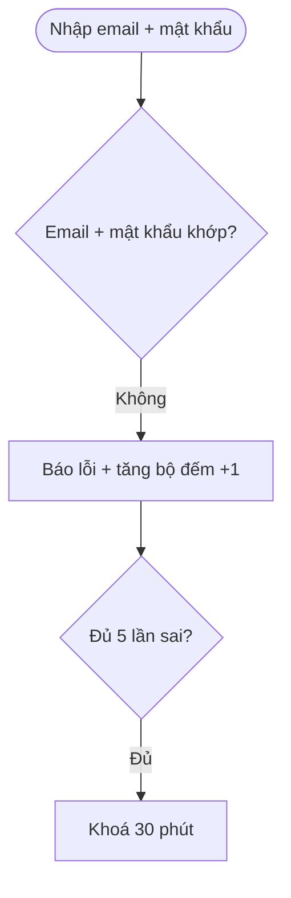
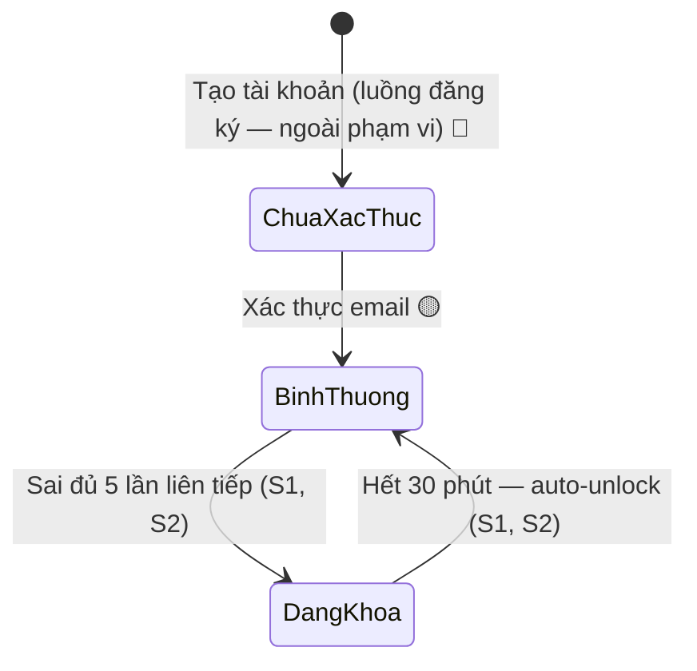

# Example — output mẫu của `/reverse-doc` (bộ SRS đầy đủ đa-tầng per-feature)‍‌‌​​‌‌​​‌‌‌​‌‌‌‌​​‌​‌​‌‌‌‌‌​‌​​‌​​​‌​​​​‌​​​​‌​​​​​​​‌‌‌​‌‌​​​‌​​‌​​​​‌​​‌‌‌‌‌​​‌‌‌‌​‌‌‌​​​​​‌‌‌​​‌​‌‌‌‌​‌‌​​‌​‌‌​​​​​‌​‌‌​​‌‌​‌‍

> Minh hoạ `/reverse-doc` tái lập 1 feature từ nguồn rời rạc thành **bộ SRS đầy đủ đa-tầng** (KHÔNG phải doc
> thật của dự án). Skill bám format này khi viết `docs/_reverse/{feature}/`. **Nguồn = proof, KHÔNG hỏi lại
> user** — mọi chỗ chưa chắc → OQ/Gap/Conflict trong `reverse-gaps.md`.

---

## 0. Cây file 1 feature (bộ đa-tầng — Phase F ghi đủ)‍‌‌​​‌‌​​‌‌‌​‌‌‌‌​​‌​‌​‌‌‌‌‌​‌​​‌​​​‌​​​​‌​​​​‌​​​​​​​‌‌‌​‌‌​​​‌​​‌​​​​‌​​‌‌‌‌‌​​‌‌‌‌​‌‌‌​​​​​‌‌‌​​‌​‌‌‌‌​‌‌​​‌​‌‌​​​​​‌​‌‌​​‌‌​‌‍

```
docs/_reverse/student-login/
├── student-login-reverse-spec.md          ← LÕI: SRS 12 Mục chi tiết + cột Nguồn/Nhãn (type: reverse-srs)
├── reverse-sources.md                     ← danh mục nguồn (S1/S2...)
├── reverse-gaps.md                        ← OQ + Gap + Conflict + Inferred
├── srs/
│   ├── student-login-reverse-flows.md     ← sequence + activity mermaid mỗi flow
│   ├── student-login-reverse-states.md    ← state diagram entity multi-state
│   └── student-login-reverse-erd.md       ← erDiagram + Entity Reference
└── usecases/
    ├── student-login-reverse-usecase-index.md  ← master + ma trận UC↔FR↔Screen↔Error↔OQ
    └── uc-login.md                         ← use case fully-dressed (a–h)
```

> Feature đơn giản (ít flow / không có entity multi-state) → có thể lược `srs/states` hoặc `srs/erd` nếu
> nguồn không đủ, ghi rõ lý do ở `reverse-gaps.md`. KHÔNG bịa diagram không có nguồn.

---

## A. Manifest `docs/_reverse/reverse-plan.json` (Phase B)‍‌‌​​‌‌​​‌‌‌​‌‌‌‌​​‌​‌​‌‌‌‌‌​‌​​‌​​​‌​​​​‌​​​​‌​​​​​​​‌‌‌​‌‌​​​‌​​‌​​​​‌​​‌‌‌‌‌​​‌‌‌‌​‌‌‌​​​​​‌‌‌​​‌​‌‌‌‌​‌‌​​‌​‌‌​​​​​‌​‌‌​​‌‌​‌‍

```json
{
  "created": "2026-07-17",
  "sources_root": "/path/to/source-docs/old-specs",
  "features": [
    {
      "slug": "student-login",
      "sources": ["S1", "S2"],
      "existing_doc": "docs/authentication/",
      "confidence": "high",
      "complexity_flags": ["lockout", "remember-me", "email-verification"],
      "status": "pending"
    }
  ]
}
```

*Máy-đọc-được → resumable (mark `status:"done"` sau mỗi feature Write XONG + verify pass) + drive batch
Phase D. `sources` liệt kê ĐỦ mọi S-id feature đó dùng. In bảng chia feature cho user THẤY (informational),
KHÔNG chặn-chờ.*

---

## B. `docs/_reverse/student-login/student-login-reverse-spec.md` (Phase F — file lõi)‍‌‌​​‌‌​​‌‌‌​‌‌‌‌​​‌​‌​‌‌‌‌‌​‌​​‌​​​‌​​​​‌​​​​‌​​​​​​​‌‌‌​‌‌​​​‌​​‌​​​​‌​​‌‌‌‌‌​​‌‌‌‌​‌‌‌​​​​​‌‌‌​​‌​‌‌‌‌​‌‌​​‌​‌‌​​​​​‌​‌‌​​‌‌​‌‍

```markdown
---
type: reverse-srs
feature: student-login
status: draft
updated: 2026-07-17
confidence_summary: "✅9 🔵1 🟡3"
links: [docs/_reverse/student-login/reverse-sources.md, docs/authentication/srs/spec.md]
---

# student-login — SRS tái lập (reverse) từ nguồn

> Tài liệu tái lập — KHÔNG phải spec đã duyệt. Mỗi mệnh đề mang nhãn tin cậy + nguồn.

## 0. Truy vết nguồn & độ tin cậy
- **Nguồn:** xem reverse-sources.md.
- **Thang nhãn:** ✅ chắc chắn · 🔵 suy đoán (≥2 nguồn) · 🟡 cần xác nhận (suy-1-nguồn HOẶC thiếu).
- **Ranh giới:** CHƯA duyệt. Chạy /srs student-login để hình thức hoá.

### 0.3 Khác biệt với tài liệu chính (docs/authentication/)
| Điểm | Reverse nói (từ nguồn) | Doc chính nói | Đề xuất |
|------|------------------------|---------------|---------|
| Thời gian khoá sau 5 fail | 30 phút (S1) | 24h auto-unlock (BR-authentication-007) | `/cr` reconcile |

## 1. Scope
Học viên đăng nhập app học tiếng Anh bằng email + mật khẩu để vào Dashboard. ✅ [S1]
Ngoài scope: đăng nhập Google (nguồn ghi "còn tranh luận" — xem OQ-1). 🟡 [S1]

## 3. Functional Requirements (FR)
| ID | Title | Description | Priority | Verify by | Nguồn | Nhãn |
|----|-------|-------------|----------|-----------|-------|------|
| FR-student-login-001 | Login email + mật khẩu | User nhập email + mật khẩu → khớp → tạo phiên, vào Dashboard | P0 | test | S1 | ✅ |
| FR-student-login-002 | Khoá sau 5 lần sai | Sai ≥5 lần liên tiếp → khoá tài khoản 30 phút | P0 | test | S1 | ✅ |
| FR-student-login-003 | Nhớ đăng nhập | Tick remember-me → giữ phiên 30 ngày | P1 | demo | S1 | ✅ |

## 6. Error Matrix
| Error ID | Title | Trigger | Severity | Related FR | Screen state | Recovery | Nguồn | Nhãn |
|----------|-------|---------|----------|------------|--------------|----------|-------|------|
| E-student-login-001 | Sai thông tin | Email/mật khẩu không khớp | major | FR-student-login-001 | Login form inline | "Email hoặc mật khẩu không đúng." | S1 | ✅ |

## 12. Open Questions
> Đầy đủ ở reverse-gaps.md. Trích blocking:
- [ ] OQ-1: Có đăng nhập Google không? Nguồn "còn tranh luận" nhưng authentication FR-005 đã chốt làm.
```

*(Các Mục 2/4/5/7/8/9/10/11 điền đủ như `_templates/reverse-srs-spec.md`, lược ở ví dụ cho gọn.)*

---

## C. `docs/_reverse/student-login/reverse-sources.md`‍‌‌​​‌‌​​‌‌‌​‌‌‌‌​​‌​‌​‌‌‌‌‌​‌​​‌​​​‌​​​​‌​​​​‌​​​​​​​‌‌‌​‌‌​​​‌​​‌​​​​‌​​‌‌‌‌‌​​‌‌‌‌​‌‌‌​​​​​‌‌‌​​‌​‌‌‌‌​‌‌​​‌​‌‌​​​​​‌​‌‌​​‌‌​‌‍

```markdown
# student-login — Danh mục nguồn (provenance)

| ID | Nguồn | Loại | Ngày | Confidence | Encoding OK? | Phần feature suy ra từ đây |
|----|-------|------|------|------------|--------------|----------------------------|
| S1 | old-specs/login-spec-cu.md | md | 2024 | high | OK | Toàn bộ flow, lockout, wording, remember-me |
```

---‍‌‌​​‌‌​​‌‌‌​‌‌‌‌​​‌​‌​‌‌‌‌‌​‌​​‌​​​‌​​​​‌​​​​‌​​​​​​​‌‌‌​‌‌​​​‌​​‌​​​​‌​​‌‌‌‌‌​​‌‌‌‌​‌‌‌​​​​​‌‌‌​​‌​‌‌‌‌​‌‌​​‌​‌‌​​​​​‌​‌‌​​‌‌​‌‍

## D. `docs/_reverse/student-login/reverse-gaps.md` (nơi chứa MỌI thứ-chưa-chắc)

```markdown
# student-login — Gaps & Open Questions

## 1. Open Questions
- [ ] OQ-1: Có đăng nhập Google không? (S1 "còn tranh luận" ↔ authentication FR-005 đã chốt) — cần: PO quyết
- [ ] OQ-2: Thời gian khoá 30 phút (S1) hay 24h (authentication BR-007)? — cần: BA reconcile

## 3. Conflicts (nguồn mâu thuẫn)
| Điểm | Nguồn A nói | Nguồn B nói | Ghi chú |
|------|-------------|-------------|---------|
| Thời gian khoá | 30 phút (S1, 2024) | 24h (docs/authentication, mới hơn) | S1 cũ hơn — để BA quyết, KHÔNG tự chọn |
```

---

## E. File tầng `srs/` — minh hoạ diagram có nhãn nguồn

`srs/student-login-reverse-flows.md` (mỗi flow 1 section `## Flow:`, mermaid + nhãn nguồn ở đầu flow). Nội dung mẫu:

~~~markdown
---
type: reverse-srs-flows
feature: student-login
updated: 2026-07-17
---

# student-login — Flows tái lập (reverse)

## Flow: Đăng nhập sai + khoá tài khoản
> Nguồn: ✅ [S1: sai 5 lần khoá 30 phút; S2: chi tiết tăng/reset bộ đếm].


~~~

`srs/student-login-reverse-states.md` (stateDiagram-v2, transition suy đoán chú thích 🔵/🟡). Nội dung mẫu:

~~~markdown
---
type: reverse-srs-states
feature: student-login
updated: 2026-07-17
---
# student-login — States tái lập (reverse)
## State: Tài khoản học viên

~~~

`usecases/uc-login.md` (fully-dressed a–h, mỗi bước/nhánh gắn nhãn + FR liên quan). Nội dung mẫu:

~~~markdown
# UC-login — Học viên đăng nhập bằng email + mật khẩu
## a. Introduction
Học viên đã đăng ký đăng nhập bằng email + mật khẩu. ✅ [S1, S2]
## b. Actors & Objects ...
## e. Activity diagram
> Xem srs/student-login-reverse-flows.md
**Main Success Scenario:** 1. Nhập email+mật khẩu ✅ [S1,S2] ...
**Extensions:** 3a. Sai → "Email hoặc mật khẩu không đúng." ✅ [S1,S2] (E-student-login-002) ...
## g. Related FR + traceability (bảng bước↔FR↔BR↔Error↔nguồn)
## h. Open Questions
~~~

*Mọi mermaid phải verify compile (`.claude/scripts/mermaid-verify.mjs --file ...`) trước khi báo xong.*

---

## Ghi chú dùng mẫu

* **Nguồn = proof, KHÔNG hỏi user** — chưa rõ/thiếu/mâu thuẫn đều thành OQ/Gap/Conflict trong `reverse-gaps.md`.
* Output = **bộ SRS đầy đủ đa-tầng**: spec 12 Mục chi tiết + srs/(flows,states,erd) + usecases/(index + uc-*).
  Mỗi FR/BR/Error viết CHI TIẾT, bóc HẾT không lược. KHÔNG API/wireframe/prototype/user story/userflow.
* Mỗi mệnh đề: cột Nguồn (S-id) + Nhãn (✅/🔵/🟡). Ảnh: wording nhìn-thấy ✅; rule sau UI 🟡.
* Diagram: chỉ vẽ bước CÓ nguồn; bước suy đoán chú thích 🔵/🟡; verify mermaid compile.
* Feature trùng → Mục 0.3 + `/cr` `/gap`, KHÔNG đè `docs/{feature}/`.
* Output vào `docs/_reverse/{feature}/` (workspace BA), KHÔNG repo nguồn.
* DỪNG ở output, route `/srs {feature}` (giữ nhãn confidence — /srs xác nhận từng 🟡).‍‌‌​​‌‌​​‌‌‌​‌‌‌‌​​‌​‌​‌‌‌‌‌​‌​​‌​​​‌​​​​‌​​​​‌​​​​​​​‌‌‌​‌‌​​​‌​​‌​​​​‌​​‌‌‌‌‌​​‌‌‌‌​‌‌‌​​​​​‌‌‌​​‌​‌‌‌‌​‌‌​​‌​‌‌​​​​​‌​‌‌​​‌‌​‌‍


<!-- wm:2b9af6c9b691879b1ddb7a04d29a1c88 -->
<sub>Tài liệu thuộc bộ AI4BA BA-Kit — bản quyền hoangphan.blog</sub>
