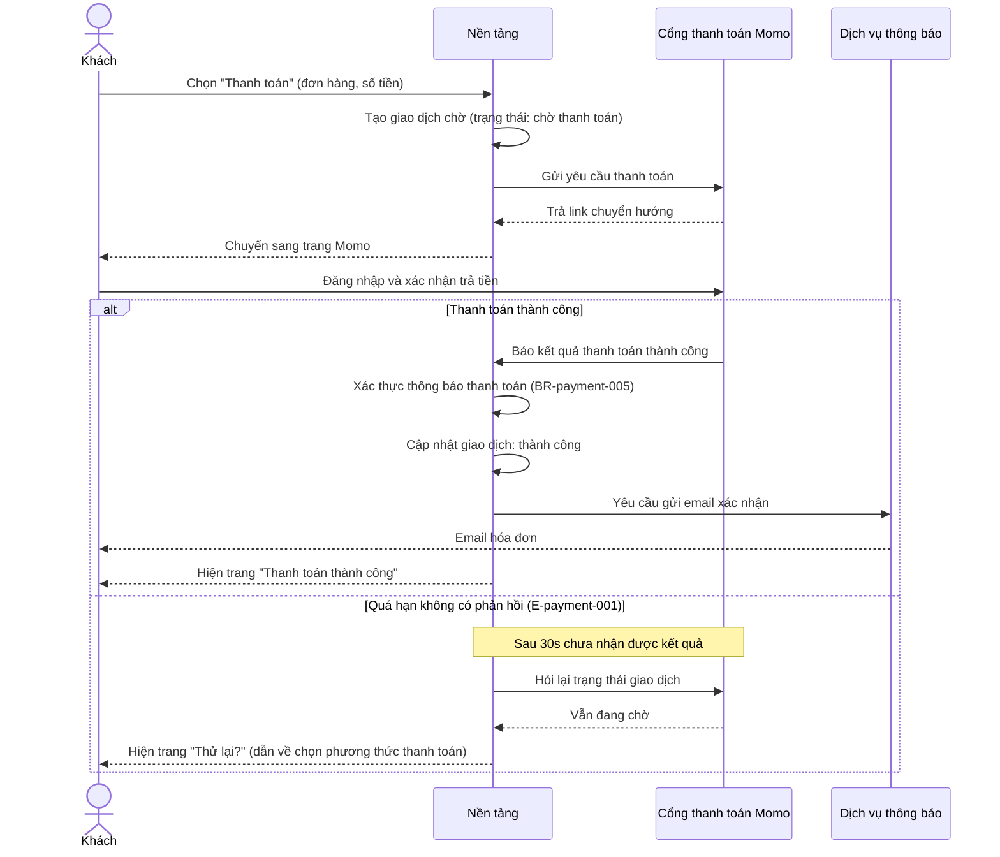

<!--
REFERENCE cho /sequence (không phải doc thật). Điểm cần bắt chước:
* File gộp: slim frontmatter (type/feature/updated) + heading trần "# {Feature} — Flows", KHÔNG câu intro/blockquote meta trong thân doc.
* Mỗi flow = 1 section "## Flow:" được APPEND (không phải file standalone).
* Message business-language: dev hiểu luồng nhưng KHÔNG bịa endpoint/SQL/thuật toán khi chưa có nguồn.
-->

# Payment — Flows‍‌‌​​‌‌​​‌‌‌​‌‌‌‌​​‌​‌​‌‌‌‌‌​‌​​‌​​​‌​​​​‌​​​​‌​​​​​​​‌‌‌​‌‌​​​‌​​‌​​​​‌​​‌‌‌‌‌​​‌‌‌‌​‌‌‌​​​​​‌‌‌​​‌​‌‌‌‌​‌‌​​‌​‌‌​​​​​‌​‌‌​​‌‌​‌‍

## Flow: Guest Checkout via Momo‍‌‌​​‌‌​​‌‌‌​‌‌‌‌​​‌​‌​‌‌‌‌‌​‌​​‌​​​‌​​​​‌​​​​‌​​​​​​​‌‌‌​‌‌​​​‌​​‌​​​​‌​​‌‌‌‌‌​​‌‌‌‌​‌‌‌​​​​​‌‌‌​​‌​‌‌‌‌​‌‌​​‌​‌‌​​​​​‌​‌‌​​‌‌​‌‍
__Trigger__: Khách guest (không đăng nhập) bấm "Thanh toán" ở màn giỏ hàng.
__Related UC__: [[../usecases/uc-guest-checkout.md]]‍‌‌​​‌‌​​‌‌‌​‌‌‌‌​​‌​‌​‌‌‌‌‌​‌​​‌​​​‌​​​​‌​​​​‌​​​​​​​‌‌‌​‌‌​​​‌​​‌​​​​‌​​‌‌‌‌‌​​‌‌‌‌​‌‌‌​​​​​‌‌‌​​‌​‌‌‌‌​‌‌​​‌​‌‌​​​​​‌​‌‌​​‌‌​‌‍
__Related FR__: FR-payment-001, FR-payment-003, FR-payment-006

## Notes‍‌‌​​‌‌​​‌‌‌​‌‌‌‌​​‌​‌​‌‌‌‌‌​‌​​‌​​​‌​​​​‌​​​​‌​​​​​​​‌‌‌​‌‌​​​‌​​‌​​​​‌​​‌‌‌‌‌​​‌‌‌‌​‌‌‌​​​​​‌‌‌​​‌​‌‌‌‌​‌‌​​‌​‌‌​​​​​‌​‌‌​​‌‌​‌‍

* __Chống xử lý trùng__ — mỗi thông báo thanh toán chỉ được ghi nhận 1 lần; nhận trùng thì giữ nguyên trạng thái đã có, không cộng tiền 2 lần (BR-payment-005). *Cách hiện thực (khóa chống trùng, xác thực chữ ký) là việc thiết kế kỹ thuật — chỉ ghi vào NFR/technical design khi đã có nguồn phê duyệt, KHÔNG vẽ thành message.*
* __Chờ kết quả__ — nếu khách quay lại app trước khi có kết quả từ cổng (mạng yếu), app chủ động hỏi lại trạng thái vài lần trước khi báo "thử lại".
* __Email không chặn thanh toán__ — gửi email là bước phụ; nếu dịch vụ thông báo lỗi, thanh toán vẫn tính thành công với khách, email gửi lại sau.

__Reference:__
* FR-payment-001, FR-payment-003, FR-payment-006 (spec Mục 2).
* E-payment-001 (spec Mục 5 — Error Matrix).
* BR-payment-005 (spec Mục 4 — quy tắc chống xử lý trùng).‍‌‌​​‌‌​​‌‌‌​‌‌‌‌​​‌​‌​‌‌‌‌‌​‌​​‌​​​‌​​​​‌​​​​‌​​​​​​​‌‌‌​‌‌​​​‌​​‌​​​​‌​​‌‌‌‌‌​​‌‌‌‌​‌‌‌​​​​​‌‌‌​​‌​‌‌‌‌​‌‌​​‌​‌‌​​​​​‌​‌‌​​‌‌​‌‍

<!-- wm:2b9af6c9b691879b1ddb7a04d29a1c88 -->
Tài liệu thuộc bộ AI4BA BA-Kit — bản quyền hoangphan.blog
