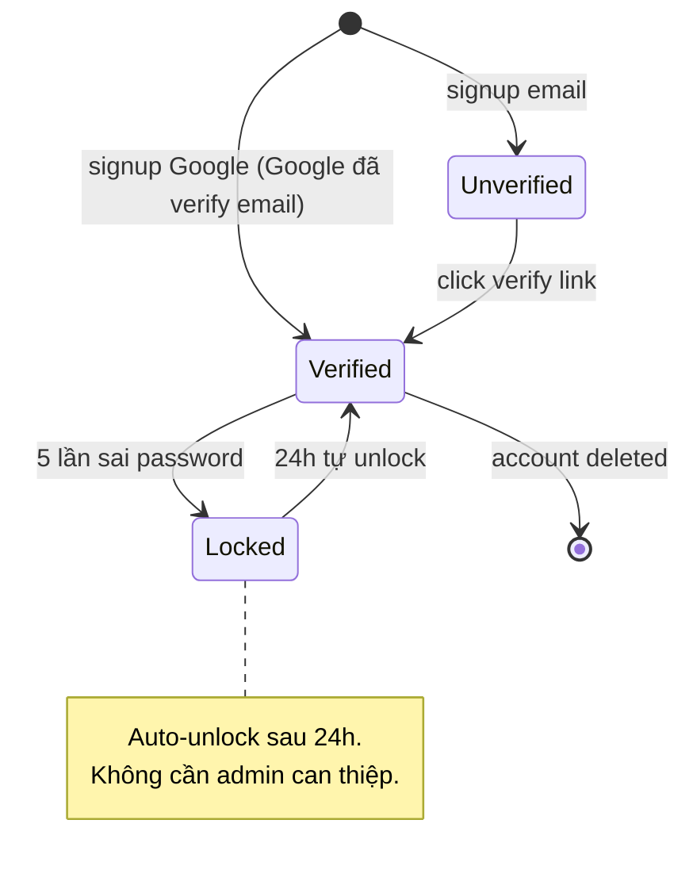

<!-- Licensed to nguyenhoangdao777@gmail.com — Order YYWVQ3VWE -->

# /state — Per-entity State Diagram‍‌‌​​‌‌​​‌‌‌​‌‌‌‌​​‌​‌​‌‌‌‌‌​‌​​‌​​​‌​​​​‌​​​​‌​​​​​​​‌‌‌​‌‌​​​‌​​‌​​​​‌​​‌‌‌‌‌​​‌‌‌‌​‌‌‌​​​​​‌‌‌​​‌​‌‌‌‌​‌‌​​‌​‌‌​​​​​‌​‌‌​​‌‌​‌‍

## Goal‍‌‌​​‌‌​​‌‌‌​‌‌‌‌​​‌​‌​‌‌‌‌‌​‌​​‌​​​‌​​​​‌​​​​‌​​​​​​​‌‌‌​‌‌​​​‌​​‌​​​​‌​​‌‌‌‌‌​​‌‌‌‌​‌‌‌​​​​​‌‌‌​​‌​‌‌‌‌​‌‌​​‌​‌‌​​​​​‌​‌‌​​‌‌​‌‍

Produce mermaid `stateDiagram-v2` cho 1 entity của feature, capture: states + transitions + triggers + invalid transitions. __Output duy nhất__: append section vào `docs/{feature}/srs/{feature}-states.md` (1 file gộp mọi entity, mỗi entity 1 `## State: <Entity>` section).

## Constraints‍‌‌​​‌‌​​‌‌‌​‌‌‌‌​​‌​‌​‌‌‌‌‌​‌​​‌​​​‌​​​​‌​​​​‌​​​​​​​‌‌‌​‌‌​​​‌​​‌​​​​‌​​‌‌‌‌‌​​‌‌‌‌​‌‌‌​​​​​‌‌‌​​‌​‌‌‌‌​‌‌​​‌​‌‌​​​​​‌​‌‌​​‌‌​‌‍

### Hard rules — never violate‍‌‌​​‌‌​​‌‌‌​‌‌‌‌​​‌​‌​‌‌‌‌‌​‌​​‌​​​‌​​​​‌​​​​‌​​​​​​​‌‌‌​‌‌​​​‌​​‌​​​​‌​​‌‌‌‌‌​​‌‌‌‌​‌‌‌​​​​​‌‌‌​​‌​‌‌‌‌​‌‌​​‌​‌‌​​​​​‌​‌‌​​‌‌​‌‍

* __1 output cố định__ — `docs/{feature}/srs/{feature}-states.md` append mode. KHÔNG flag `--uc`, `--append`, `--system-flow`.
* **`--feature` optional** — auto-detect từ ngữ cảnh/feature đang làm dở; mơ hồ mới hỏi bằng picker. __Feature chưa tồn tại + arg cho biết entity/feature mới → tự derive slug + tạo feature__ (điểm-vào, xem `feature-bootstrap.md` nhóm A). KHÔNG bắt qua `/brainstorm` trước.
* __L1 approval__ trước Write — show entity + state count + transition count.
* __KHÔNG L3 iterate__ — mermaid không render trong chat. User review từ rendered file, muốn sửa thì gọi lại skill và nói cần đổi gì.
* __Auto-detect states__ từ:
  * `docs/{feature}/brainstorms/*.md` Mục 6.3 State Transitions table.
  * `docs/{feature}/srs/{feature}-spec.md` Mục 4 Business Rules nếu mention state transition.
  * Nếu không có → clarifying questions. User muốn dùng nguồn khác → tag `@file` hoặc dán nội dung trong câu chat.
* __Invalid transitions explicit__ — table riêng trong section liệt kê transitions KHÔNG được phép.
* __Vietnamese-first__ trong description/notes, auto-detect từ seed. Muốn tiếng Anh thì nói "viết bằng tiếng Anh". Mermaid syntax keywords giữ English.
* __Per @../../rules/diagram-selection.md__ — entity ≥3 states trước proceed; <3 → warn "bảng đủ, có cần diagram?".
* __states.md không tồn tại__ → tạo mới với header skeleton.

### Pitfalls — easy to get wrong‍‌‌​​‌‌​​‌‌‌​‌‌‌‌​​‌​‌​‌‌‌‌‌​‌​​‌​​​‌​​​​‌​​​​‌​​​​​​​‌‌‌​‌‌​​​‌​​‌​​​​‌​​‌‌‌‌‌​​‌‌‌‌​‌‌‌​​​​​‌‌‌​​‌​‌‌‌‌​‌‌​​‌​‌‌​​​​​‌​‌‌​​‌‌​‌‍

* __Composite states__ — Mermaid hỗ trợ nested nhưng >2 level render rối. Giữ flat khi có thể.
* __Entity name__ — UpperCamelCase (Account, Order, VerifyLink).
* __Multiple entry points__ — dùng nhiều `[*] -->` lines.
* __Self-loop__ — `State1 --> State1 : retry` OK, nhưng nhiều retry cùng state nên gom note.
* __Invalid transitions__ — KHÔNG vẽ trong diagram (bẩn); table riêng.
* __Update mode__ — preserve user edits trong notes section; chỉ regenerate mermaid + tables.
* __UC embed__ — nếu user yêu cầu "vẽ state vào UC X", refuse + giải thích "state thuộc states.md vì entity thường shared cross UC".
* __Mermaid syntax fail__ — bước 9.5 bắt lỗi qua `mermaid-verify.mjs` NGAY sau Write, tự sửa tối đa 2 lần. KHÔNG write rồi bỏ mặc — chỉ báo user paste mermaid.live nếu 2 lần tự sửa vẫn fail.
* __Coverage thiếu ≠ lỗi cú pháp__ — bước 9.5 (compile) và 9.6 (coverage) là 2 việc khác nhau. Diagram compile OK vẫn có thể thiếu 1 state so với fact-list — đừng nhầm "compile OK" là "xong".

## Inputs

```
/state <entity> --feature <slug>       # append section vào states.md
/state <entity>                        # feature auto-detect từ ngữ cảnh, mơ hồ mới hỏi
/state <entity> "<feature mới>"        # feature chưa có → derive slug + phỏng vấn + tạo feature (nhóm A)
```

Muốn đổi hành vi mặc định, nói bằng lời:
* Dùng nguồn khác thay vì brainstorm/spec mặc định → tag `@file` hoặc dán nội dung.
* Viết bằng tiếng Anh → nói "viết bằng tiếng Anh".
* Đã có section cho entity đó → gọi lại skill, skill tự vào update mode (L2 diff).

## Context (dynamic)

Today: !`date +%Y-%m-%d`
Features có sẵn: !`ls -d docs/*/ 2>/dev/null | xargs -I{} basename {} | head -20`
Features có states.md: !`for d in docs/*/srs/*-states.md; do [ -f "$d" ] && echo "$d"; done | head -10`

## Approach

1) __Resolve feature + entity__ — feature từ arg/picker; entity UpperCamelCase từ arg.
   * **Feature chưa tồn tại (điểm-vào, per `feature-bootstrap.md` nhóm A):** nếu chưa có `docs/{feature}/` nào khớp và arg cho thấy đây là entity/feature mới (vd `/state Order "quản lý đơn hàng"`) → `/state` ĐƯỢC PHÉP tự khởi tạo: derive feature slug từ mô tả (kebab-case, ASCII, ≤50 ký tự; slug rõ không suy được thì hỏi), confirm slug ở L1 (user override được), tạo `docs/{feature}/srs/` khi Write. KHÔNG bắt user chạy `/brainstorm` trước.
2) __Auto-detect existing state info:__
   * Read `docs/{feature}/brainstorms/*.md` Mục 6.3 — pull rows liên quan entity.
   * Read `docs/{feature}/srs/{feature}-spec.md` Mục 4 — pull BR liên quan state.
   * Có nguồn → dùng, không hỏi lại cái đã có (no-re-ask).
   * __Không có nguồn (feature mới hoặc cũ thiếu brainstorm/spec)__ → __phỏng vấn ĐÚNG PHẠM VI state cần__ (per `feature-bootstrap.md` nhóm A bước 3), hỏi gom 1 batch business-language (KHÔNG hỏi DB/SDK): __entity nào__ (nếu chưa rõ) · __các trạng thái__ entity đi qua · __trigger__ mỗi transition (sự kiện/hành động nào chuyển trạng thái) · __transition cấm__ (từ trạng thái nào KHÔNG được quay về đâu). KHÔNG bịa — thiếu ý nào hỏi ý đó. Làm rõ đủ để vẽ đúng, không lan man toàn diện như `/brainstorm`.
   * __Mô tả mơ hồ dù có nguồn__ (vd brainstorm/spec chỉ nhắc chung chung "có nhiều trạng thái" mà không liệt kê rõ) → __PHẢI hỏi clarifying trước khi generate__, KHÔNG tự suy đoán trạng thái/trigger. Câu hỏi tối thiểu: "Entity có những trạng thái nào?", "Trigger chuyển trạng thái là gì?".
2.5. __Trích fact-list (checklist coverage)__ — TRƯỚC khi generate, liệt kê ngắn gọn (giữ trong context):
   * __States__: mọi trạng thái entity sẽ đi qua.
   * __Transitions__: mỗi transition + trigger tương ứng.
   * __Invalid transitions__: mọi transition bị cấm đã nêu (sẽ vào bảng riêng, không vẽ trong diagram).
   Fact-list dùng làm checklist đối chiếu ở bước 9.6.‍‌‌​​‌‌​​‌‌‌​‌‌‌‌​​‌​‌​‌‌‌‌‌​‌​​‌​​​‌​​​​‌​​​​‌​​​​​​​‌‌‌​‌‌​​​‌​​‌​​​​‌​​‌‌‌‌‌​​‌‌‌‌​‌‌‌​​​​​‌‌‌​​‌​‌‌‌‌​‌‌​​‌​‌‌​​​​​‌​‌‌​​‌‌​‌‍
3) __Validate states count__ — <3 states, warn "bảng có thể đủ; tiếp tục diagram?" Y/n.
4) __Validate target__ `docs/{feature}/srs/{feature}-states.md`:
   * Tồn tại + trùng entity → tự vào update mode (L2 diff cho section đó).
   * Tồn tại, entity mới → append `## State: {Entity}` section.
   * Thiếu → tạo mới với slim frontmatter (`type: srs-states`, `feature`, `updated`) + intro skeleton.
5) __Generate mermaid stateDiagram-v2:__
   * `[*] --> initial_state` cho entry.
   * `state --> next_state : trigger / condition`.
   * `final_state --> [*]` cho terminal nếu có.
   * Composite states (nested) chỉ khi cần — KHÔNG over-engineer.
6) __L1 plan preview__ — prose BA-friendly: "Em sẽ append state diagram cho entity {entity} vào docs/{feature}/srs/{feature}-states.md với N states + M transitions + K invalid. Apply? (Y / sửa)".
7) __Write__ — Read states.md, append section. Mỗi section format:
   ```markdown
   ## State: {Entity}
   **Related entity**: {Entity} (CamelCase khớp ERD `srs/{feature}-erd.md` — nguồn edge state→entity)
   **Related UC**: [[../usecases/uc-{slug}.md]], ...
   **Related BR**: BR-{feature}-NNN, ...

   \`\`\`mermaid
   stateDiagram-v2
     ...
   \`\`\`

   ### Invalid transitions
   | From | To | Why not |
   |---|---|---|
   | paid | pending | Đã thanh toán không quay lại pending |
   ```
   > __ID full-form bắt buộc__ trong dòng Related — luôn `BR-{feature}-NNN`, KHÔNG short-form `BR-001` (nguồn edge cho KG; short-form gây feature-ma + mất trace). __Related entity__ viết CamelCase khớp ERD.
8) __Gọi lại với entity trùng__ (update mode tự động) → L2 diff cho section đó.
9) __Activity log__ — set env `CLAUDE_SKILL_NAME=/state` + `CLAUDE_CHANGELOG_NOTE` (note: `added/updated {Entity} state diagram`) TRƯỚC khi Write — hook append vào `docs/_shared/changelog.md` (không phụ thuộc spec.md tồn tại hay chưa, không còn routing/fallback). Update states.md `updated: {date}`.
9.5. __Render-verify + TỰ XEM ẢNH (BẮT BUỘC, chạy ngay sau Write)__ — `node .claude/scripts/mermaid-verify.mjs --file docs/{feature}/srs/{feature}-states.md --png <scratchpad>/state-review`. Cờ `--png` vừa compile-check vừa xuất ảnh PNG mỗi block để skill __tự Read xem hình__. Mermaid không render trong chat (đây là lý do skip L3), nên đây là cách duy nhất bắt lỗi TRƯỚC khi báo "xong" thay vì để user tự phát hiện khi mở IDE.
   * Script chạy __3 tầng, báo tách riêng__: cú pháp compile · nhãn an toàn renderer · __ngữ nghĩa__.
     Tầng ngữ nghĩa cho state bắt: thiếu `[*] -->` khởi đầu (__error__), state không tới được từ
     `[*]` (__error__), dấu `;` trong nhãn transition (__error__ — mermaid cắt thành node rác),
     state điểm-chết không có `--> [*]` (__cảnh báo__), transition thiếu trigger (__cảnh báo__).
   * __Cảnh báo điểm-chết phải tự xét, không bỏ qua mặc định__: nếu state là kết cục cuối vòng đời
     (`used`/`expired`/`revoked`) thì THÊM `--> [*]`; nếu là trạng thái ổn định lâu dài thì giữ.
   * Còn `error` → sửa rồi chạy lại (tối đa 2 vòng). KHÔNG báo "xong" khi vẫn còn error.
   * __Compile fail__ → đọc lỗi dòng/cột script trả về, sửa lại section vừa append (KHÔNG đụng entity khác), verify lại. Tối đa 2 lần tự sửa.
   * __Compile pass__ → __Read ảnh PNG__ (`<scratchpad>/state-review/block-{n}.png` — block của entity vừa ghi) và TỰ SOI nghiệp vụ (compile-check + coverage text KHÔNG bắt được lỗi hình):
     * [ ] State mồ côi? Mọi state có đường vào (và đường ra, trừ terminal) — không state nào lơ lửng không nối.
     * [ ] Entry/terminal đúng? Có `[*] -->` vào initial state; terminal (nếu có) `--> [*]`.
     * [ ] Transition đúng chiều? `Verified --> Locked` khác `Locked --> Verified` — đừng vẽ ngược.
     * [ ] Nhãn trigger đọc được, không che nhau / không wrap dài mất chữ.
     * Lỗi bất kỳ → sửa section vừa ghi, re-render + re-xem. Tối đa 2 vòng.
   * __Vẫn fail sau 2 lần__ → báo user rõ lỗi cụ thể + đoạn mermaid, gợi ý paste mermaid.live để debug tay. KHÔNG âm thầm để file lỗi/xấu mà báo "xong" bình thường.
9.6. __Coverage-verify (BẮT BUỘC, chạy ngay sau 9.5 pass)__ — đối chiếu diagram vừa ghi với fact-list ở bước 2.5: mỗi state có xuất hiện thành 1 node không; mỗi transition có xuất hiện với đúng trigger không. Đây là compile-check KHÁC bước 9.5 — 9.5 chỉ bắt lỗi cú pháp, 9.6 bắt lỗi __thiếu state/transition so với fact-list__.
   * __Đủ__ → tiếp bước 10, report thêm dòng "Coverage: {N}/{N} states, {M}/{M} transitions".
   * __Thiếu__ (vd 1 state không xuất hiện, hoặc 1 transition thiếu trigger) → tự bổ sung vào section vừa ghi, verify lại 9.5 rồi 9.6. Tối đa 2 lần tự sửa.
   * __Vẫn thiếu sau 2 lần__ → báo user rõ state/transition nào chưa thể hiện được. KHÔNG âm thầm báo "xong" khi coverage chưa đủ.
10) __Output report:__
    ```
    ✅ State diagram appended: docs/{feature}/srs/{feature}-states.md → ## State: {Entity}
       States: {N} | Transitions: {M} | Invalid: {K} | Mermaid compile: OK | Đã tự soi ảnh | Coverage: {N}/{N} states, {M}/{M} transitions

    Mở file trong IDE/Obsidian/GitHub preview để xem rendered diagram.
    Cần sửa? Gọi lại /state {entity} --feature {feature}, em tự vào update mode.
    ```

## Output

`docs/{feature}/srs/{feature}-states.md` — __append 1 section__ `## State: {Entity}` với mermaid `stateDiagram-v2`. 1 file gộp mọi entity của feature. Slim frontmatter (`type: srs-states` / `feature` / `updated`).

Hook tự ghi 1 dòng vào `docs/_shared/changelog.md`.

## Mermaid syntax reference



## References

* @../../rules/ba-conventions.md
* @../../rules/approval-gate.md
* @../../rules/naming-conventions.md
* @../../rules/changelog.md
* @../../rules/diagram-selection.md
* @../../rules/diagram-correctness.md
* @../../rules/feature-bootstrap.md
* @../../../_templates/diagram-state.md
* @../../scripts/mermaid-verify.mjs (render-verify sau Write — bước 9.5)‍‌‌​​‌‌​​‌‌‌​‌‌‌‌​​‌​‌​‌‌‌‌‌​‌​​‌​​​‌​​​​‌​​​​‌​​​​​​​‌‌‌​‌‌​​​‌​​‌​​​​‌​​‌‌‌‌‌​​‌‌‌‌​‌‌‌​​​​​‌‌‌​​‌​‌‌‌‌​‌‌​​‌​‌‌​​​​​‌​‌‌​​‌‌​‌‍


<!-- wm:2b9af6c9b691879b1ddb7a04d29a1c88 -->
<sub>Tài liệu thuộc bộ AI4BA BA-Kit — bản quyền ai4ba.com</sub>
