# authentication — Entity Relationship Diagram‍‌‌​​‌‌​​‌‌‌​‌‌‌‌​​‌​‌​‌‌‌‌‌​‌​​‌​​​‌​​​​‌​​​​‌​​​​​​​‌‌‌​‌‌​​​‌​​‌​​​​‌​​‌‌‌‌‌​​‌‌‌‌​‌‌‌​​​​​‌‌‌​​‌​‌‌‌‌​‌‌​​‌​‌‌​​​​​‌​‌‌​​‌‌​‌‍

> Scope: data model cho auth (tài khoản, thông tin đăng nhập, liên kết Google, token xác nhận/đặt lại, phiên, lần đăng nhập sai). Mô tả thuộc tính nghiệp vụ; loại bỏ chi tiết lưu trữ thuần kỹ thuật (thuật toán băm, kiểu cột DB).

## Diagram‍‌‌​​‌‌​​‌‌‌​‌‌‌‌​​‌​‌​‌‌‌‌‌​‌​​‌​​​‌​​​​‌​​​​‌​​​​​​​‌‌‌​‌‌​​​‌​​‌​​​​‌​​‌‌‌‌‌​​‌‌‌‌​‌‌‌​​​​​‌‌‌​​‌​‌‌‌‌​‌‌​​‌​‌‌​​​​​‌​‌‌​​‌‌​‌‍

```mermaid
erDiagram
    ACCOUNT ||--o| CREDENTIAL : "có tối đa 1 thông tin đăng nhập"
    ACCOUNT ||--o| LINKED_PROVIDER : "liên kết tối đa 1 Google"
    ACCOUNT ||--o{ VERIFICATION_TOKEN : "có nhiều link xác nhận"
    ACCOUNT ||--o{ RESET_TOKEN : "có nhiều link đặt lại"
    ACCOUNT ||--o{ SESSION : "có nhiều phiên"
    ACCOUNT ||--o{ LOGIN_ATTEMPT : "có nhiều lần thử đăng nhập"

    ACCOUNT {
        string email PK "định danh duy nhất"
        string status "unverified | verified | locked"
        datetime created_at "thời điểm tạo"
        datetime locked_until "null nếu không bị khóa"
    }

    CREDENTIAL {
        string account_email FK "thuộc tài khoản"
        string password_stored "không plaintext, trống nếu gốc Google chưa đặt"
        datetime updated_at "thời điểm cập nhật gần nhất"
    }

    LINKED_PROVIDER {
        string account_email FK "thuộc tài khoản"
        string provider "Google"
        string provider_user_id "định danh Google"
        datetime linked_at "thời điểm liên kết (audit)"
    }

    VERIFICATION_TOKEN {
        string account_email FK "thuộc tài khoản"
        string state "pending | used | expired"
        datetime created_at "thời điểm tạo"
        datetime expires_at "tạo cộng 24 giờ"
    }

    RESET_TOKEN {
        string account_email FK "thuộc tài khoản"
        string state "pending | used | expired"
        datetime created_at "thời điểm tạo"
        datetime expires_at "tạo cộng 30 phút"
    }

    SESSION {
        string account_email FK "thuộc tài khoản"
        string device_info "thiết bị đăng nhập"
        string state "active | revoked"
        boolean remember_me "mặc định false, 30 ngày nếu true"
        datetime created_at "thời điểm tạo"
    }

    LOGIN_ATTEMPT {
        string account_email FK "thuộc tài khoản"
        int consecutive_failures "đếm sai liên tiếp cho ngưỡng captcha 3 / khóa 5"
        datetime last_attempt_at "thời điểm lần thử gần nhất"
    }
```

## Entity Reference‍‌‌​​‌‌​​‌‌‌​‌‌‌‌​​‌​‌​‌‌‌‌‌​‌​​‌​​​‌​​​​‌​​​​‌​​​​​​​‌‌‌​‌‌​​​‌​​‌​​​​‌​​‌‌‌‌‌​​‌‌‌‌​‌‌‌​​​​​‌‌‌​​‌​‌‌‌‌​‌‌​​‌​‌‌​​​​​‌​‌‌​​‌‌​‌‍

| Entity | Mục đích | Thuộc tính nghiệp vụ chính |
|--------|----------|----------------------------|
| ACCOUNT | Danh tính người dùng, khóa bằng email | email (PK), status (`unverified`/`verified`/`locked`), created_at, locked_until |
| CREDENTIAL | Thông tin đăng nhập email/mật khẩu của tài khoản | password_stored (không plaintext, có thể trống nếu gốc Google), updated_at |
| LINKED_PROVIDER | Liên kết tài khoản với Google (tự liên kết theo email) | provider (Google), provider_user_id, linked_at |
| VERIFICATION_TOKEN | Link xác nhận email (hạn 24 giờ) | state (`pending`/`used`/`expired`), expires_at |
| RESET_TOKEN | Link đặt lại mật khẩu (hạn 30 phút) | state (`pending`/`used`/`expired`), expires_at |
| SESSION | Phiên đăng nhập trên 1 thiết bị | device_info, state (`active`/`revoked`), remember_me, created_at |‍‌‌​​‌‌​​‌‌‌​‌‌‌‌​​‌​‌​‌‌‌‌‌​‌​​‌​​​‌​​​​‌​​​​‌​​​​​​​‌‌‌​‌‌​​​‌​​‌​​​​‌​​‌‌‌‌‌​​‌‌‌‌​‌‌‌​​​​​‌‌‌​​‌​‌‌‌‌​‌‌​​‌​‌‌​​​​​‌​‌‌​​‌‌​‌‍
| LOGIN_ATTEMPT | Theo dõi số lần đăng nhập sai liên tiếp của tài khoản | consecutive_failures, last_attempt_at |

## Notes & Assumptions‍‌‌​​‌‌​​‌‌‌​‌‌‌‌​​‌​‌​‌‌‌‌‌​‌​​‌​​​‌​​​​‌​​​​‌​​​​​​​‌‌‌​‌‌​​​‌​​‌​​​​‌​​‌‌‌‌‌​​‌‌‌‌​‌‌‌​​​​​‌‌‌​​‌​‌‌‌‌​‌‌​​‌​‌‌​​​​​‌​‌‌​​‌‌​‌‍

* `ACCOUNT.email` là định danh duy nhất — cả email/mật khẩu lẫn Google đều quy về khóa email này để tự liên kết (BR-authentication-002).
* `CREDENTIAL.password_stored` có thể trống: tài khoản gốc qua Google chưa có mật khẩu cho tới khi người dùng tạo (bắt buộc trước khi gỡ liên kết Google — FR-authentication-024).
* Một tài khoản liên kết tối đa 1 Google (`ACCOUNT` 1:0..1 `LINKED_PROVIDER`); gỡ liên kết thì xóa bản ghi này.
* Tài khoản tạo qua Google được coi là `verified` ngay (BR-authentication-009) — không cần VERIFICATION_TOKEN.
* VERIFICATION_TOKEN / RESET_TOKEN giữ lịch sử trạng thái (`used`/`expired`) để chống dùng lại và phục vụ audit; token mới vô hiệu token cũ khi gửi lại.
* Tài khoản `unverified` quá 24 giờ bị tiến trình nền tự xóa (BR-authentication-010) — kéo theo xóa VERIFICATION_TOKEN liên quan.
* `LOGIN_ATTEMPT.consecutive_failures` phục vụ ngưỡng captcha (3) và khóa (5); lỗi mạng KHÔNG ghi vào bộ đếm (BR-authentication-011). Điều kiện reset bộ đếm "liên tiếp" còn mở (spec.md OQ-3).
* Tài khoản không giới hạn số phiên đồng thời, phiên không tự hết hạn (FR-authentication-021); reset mật khẩu thu hồi toàn bộ phiên (BR-authentication-007).

*Cross-ref: `docs/authentication/srs/authentication-spec.md` Mục 8 Data Entities, Mục 5 Business Rules.*‍‌‌​​‌‌​​‌‌‌​‌‌‌‌​​‌​‌​‌‌‌‌‌​‌​​‌​​​‌​​​​‌​​​​‌​​​​​​​‌‌‌​‌‌​​​‌​​‌​​​​‌​​‌‌‌‌‌​​‌‌‌‌​‌‌‌​​​​​‌‌‌​​‌​‌‌‌‌​‌‌​​‌​‌‌​​​​​‌​‌‌​​‌‌​‌‍

<!-- wm:2b9af6c9b691879b1ddb7a04d29a1c88 -->
Tài liệu thuộc bộ AI4BA BA-Kit — bản quyền ai4ba.com
