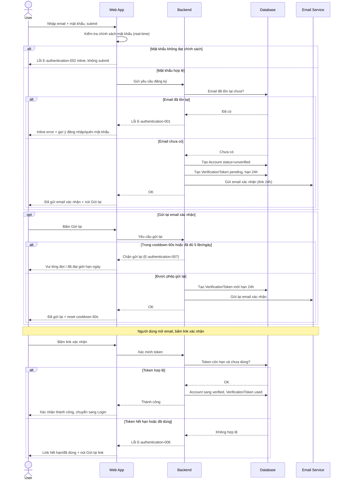
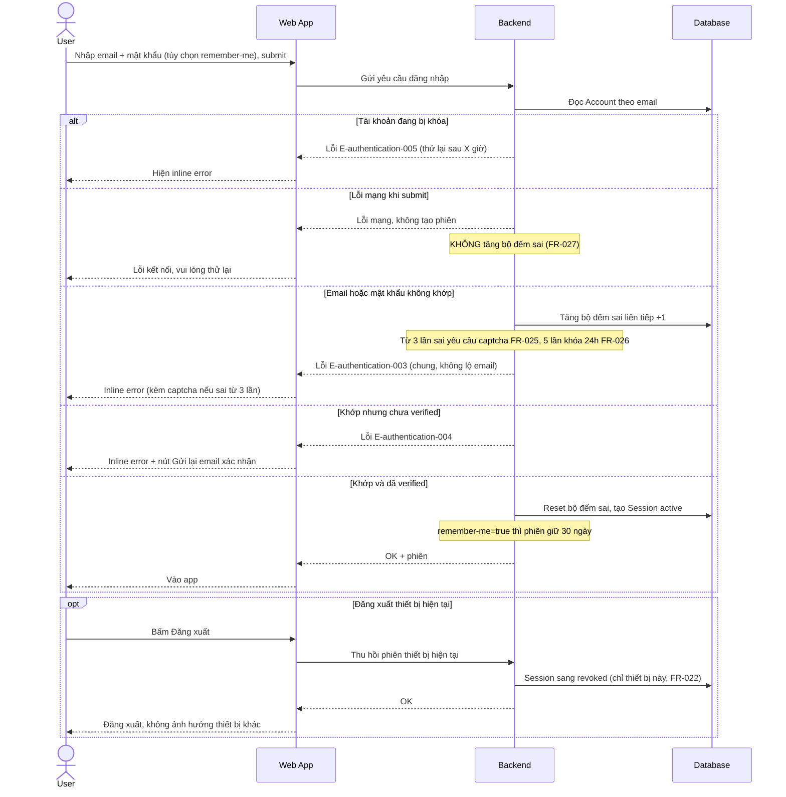
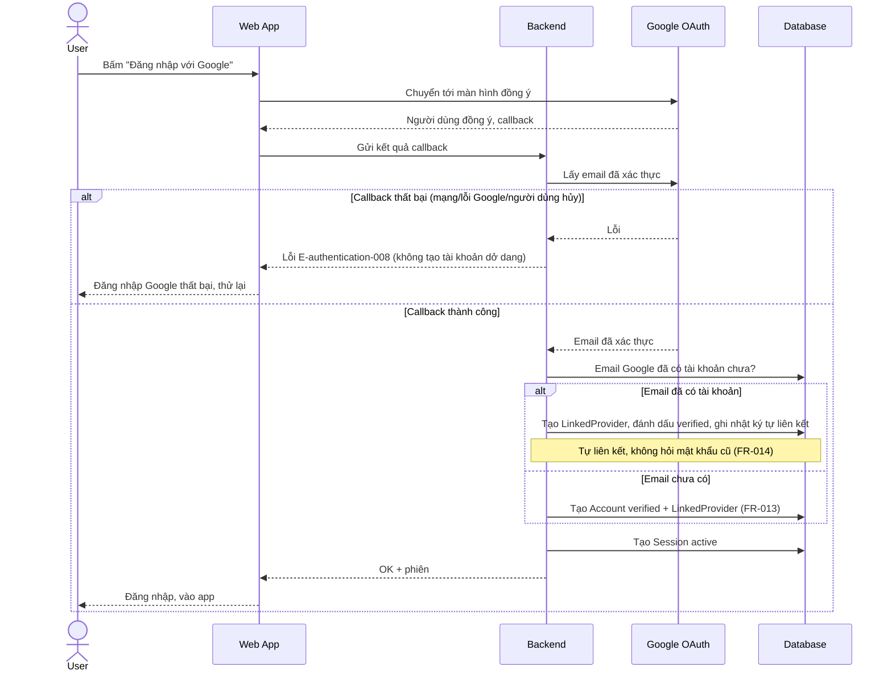
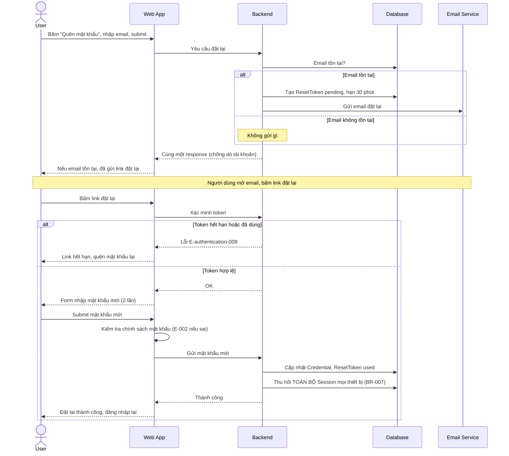
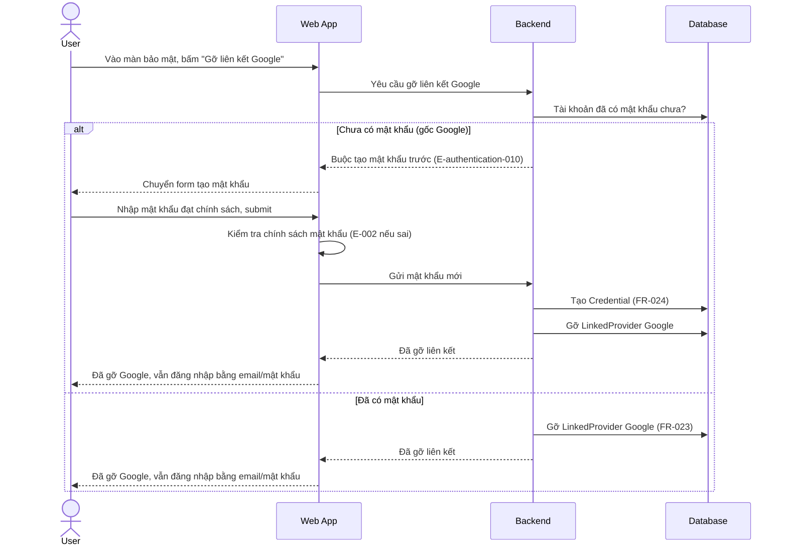

# authentication — Flows‍‌‌​​‌‌​​‌‌‌​‌‌‌‌​​‌​‌​‌‌‌‌‌​‌​​‌​​​‌​​​​‌​​​​‌​​​​​​​‌‌‌​‌‌​​​‌​​‌​​​​‌​​‌‌‌‌‌​​‌‌‌‌​‌‌‌​​​​​‌‌‌​​‌​‌‌‌‌​‌‌​​‌​‌‌​​​​​‌​‌‌​​‌‌​‌‍

> Sequence diagram cho các flow kỹ thuật của feature authentication. Mỗi flow 1 section. Lifecycle inherit từ `srs/authentication-spec.md`.

## Flow: Đăng ký email + xác nhận email‍‌‌​​‌‌​​‌‌‌​‌‌‌‌​​‌​‌​‌‌‌‌‌​‌​​‌​​​‌​​​​‌​​​​‌​​​​​​​‌‌‌​‌‌​​​‌​​‌​​​​‌​​‌‌‌‌‌​​‌‌‌‌​‌‌‌​​​​​‌‌‌​​‌​‌‌‌‌​‌‌​​‌​‌‌​​​​​‌​‌‌​​‌‌​‌‍

Liên quan: FR-authentication-001..007 | Error: E-authentication-001, 002, 006, 007 | Related UC: uc-signup-email, uc-verify-email.

## Flow: Đăng nhập email + mật khẩu (kèm captcha/khóa)‍‌‌​​‌‌​​‌‌‌​‌‌‌‌​​‌​‌​‌‌‌‌‌​‌​​‌​​​‌​​​​‌​​​​‌​​​​​​​‌‌‌​‌‌​​​‌​​‌​​​​‌​​‌‌‌‌‌​​‌‌‌‌​‌‌‌​​​​​‌‌‌​​‌​‌‌‌‌​‌‌​​‌​‌‌​​​​​‌​‌‌​​‌‌​‌‍

Liên quan: FR-authentication-008..011, 021, 022, 025, 026, 027 | Error: E-authentication-003, 004, 005 | Related UC: uc-login-email.

## Flow: Đăng ký/đăng nhập bằng Google (OAuth) + tự liên kết‍‌‌​​‌‌​​‌‌‌​‌‌‌‌​​‌​‌​‌‌‌‌‌​‌​​‌​​​‌​​​​‌​​​​‌​​​​​​​‌‌‌​‌‌​​​‌​​‌​​​​‌​​‌‌‌‌‌​​‌‌‌‌​‌‌‌​​​​​‌‌‌​​‌​‌‌‌‌​‌‌​​‌​‌‌​​​​​‌​‌‌​​‌‌​‌‍

Liên quan: FR-authentication-012..015 | Error: E-authentication-008 | Related UC: uc-google-oauth.

## Flow: Quên mật khẩu — đặt lại + đăng xuất mọi phiên‍‌‌​​‌‌​​‌‌‌​‌‌‌‌​​‌​‌​‌‌‌‌‌​‌​​‌​​​‌​​​​‌​​​​‌​​​​​​​‌‌‌​‌‌​​​‌​​‌​​​​‌​​‌‌‌‌‌​​‌‌‌‌​‌‌‌​​​​​‌‌‌​​‌​‌‌‌‌​‌‌​​‌​‌‌​​​​​‌​‌‌​​‌‌​‌‍

Liên quan: FR-authentication-016..020 | Error: E-authentication-002, 009 | BR: BR-authentication-007, 008 | Related UC: uc-forgot-password.

## Flow: Gỡ liên kết Google (buộc đặt mật khẩu trước nếu chưa có)

Liên quan: FR-authentication-023, 024, 003 | Error: E-authentication-010 | BR: BR-authentication-004 | Related UC: uc-unlink-google.‍‌‌​​‌‌​​‌‌‌​‌‌‌‌​​‌​‌​‌‌‌‌‌​‌​​‌​​​‌​​​​‌​​​​‌​​​​​​​‌‌‌​‌‌​​​‌​​‌​​​​‌​​‌‌‌‌‌​​‌‌‌‌​‌‌‌​​​​​‌‌‌​​‌​‌‌‌‌​‌‌​​‌​‌‌​​​​​‌​‌‌​​‌‌​‌‍

<!-- wm:2b9af6c9b691879b1ddb7a04d29a1c88 -->
Tài liệu thuộc bộ AI4BA BA-Kit — bản quyền hoangphan.blog
