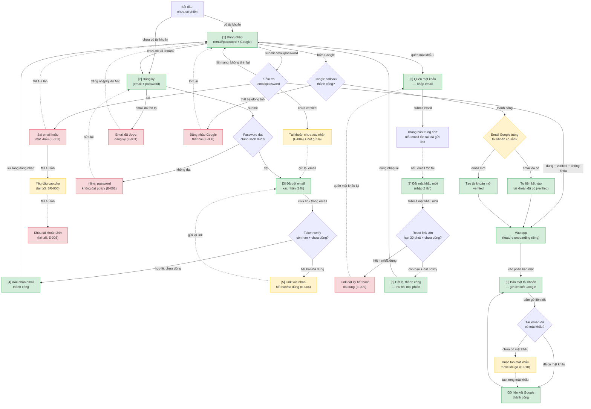

# authentication — User Flow‍‌‌​​‌‌​​‌‌‌​‌‌‌‌​​‌​‌​‌‌‌‌‌​‌​​‌​​​‌​​​​‌​​​​‌​​​​​​​‌‌‌​‌‌​​​‌​​‌​​​​‌​​‌‌‌‌‌​​‌‌‌‌​‌‌‌​​​​​‌‌‌​​‌​‌‌‌‌​‌‌​​‌​‌‌​​​​​‌​‌‌​​‌‌​‌‍

> Nguồn chia flow DUY NHẤT cho feature này. `/wireframe-ascii` và `/wireframe-html` đọc file này để biết flow nào gồm những màn nào — KHÔNG tự chia flow riêng.
>
> Derived từ `srs/authentication-spec.md` (31 FR, Mục 9 Flows, Mục 10 Screens, 10 error codes). Phủ happy / error / edge cases. Device chính: **desktop 1024** (responsive webapp — form auth căn giữa trong box hẹp ~400px theo `ba-conventions.md` Mục 8).

## 1. User Flow (tổng)‍‌‌​​‌‌​​‌‌‌​‌‌‌‌​​‌​‌​‌‌‌‌‌​‌​​‌​​​‌​​​​‌​​​​‌​​​​​​​‌‌‌​‌‌​​​‌​​‌​​​​‌​​‌‌‌‌‌​​‌‌‌‌​‌‌‌​​​​​‌‌‌​​‌​‌‌‌‌​‌‌​​‌​‌‌​​​​​‌​‌‌​​‌‌​‌‍

> `[n]` = số màn hình đối chiếu Mục 2. Xanh = happy, đỏ = error, vàng = edge.

## 2. Danh sách màn hình‍‌‌​​‌‌​​‌‌‌​‌‌‌‌​​‌​‌​‌‌‌‌‌​‌​​‌​​​‌​​​​‌​​​​‌​​​​​​​‌‌‌​‌‌​​​‌​​‌​​​​‌​​‌‌‌‌‌​​‌‌‌‌​‌‌‌​​​​​‌‌‌​​‌​‌‌‌‌​‌‌​​‌​‌‌​​​​​‌​‌‌​​‌‌​‌‍

| [#] | Màn hình | Mục đích | Thuộc flow |
|-----|----------|----------|------------|
| 1 | login | Đăng nhập email/password hoặc qua Google; lối vào đăng ký + quên mật khẩu; các trạng thái E-003/E-004/E-005 + captcha | login-email, google-oauth |
| 2 | signup | Đăng ký tài khoản mới email + password, đo độ mạnh mật khẩu; lỗi E-001/E-002 | signup-verify |
| 3 | verify-sent | Thông báo đã gửi email xác nhận (hạn 24h) + nút gửi lại (cooldown 60s / 5 lần/ngày) | signup-verify |
| 4 | verify-result-success | Xác nhận email thành công → chuyển về login | signup-verify |
| 5 | verify-result-expired | Link xác nhận hết hạn/đã dùng (E-006) + gửi lại link | signup-verify |
| 6 | forgot-password | Nhập email để nhận link đặt lại; thông báo trung tính chống dò tài khoản | forgot-password |
| 7 | reset-password | Đặt mật khẩu mới (nhập 2 lần) sau khi click link còn hạn 30 phút; lỗi E-002/E-009 | forgot-password |‍‌‌​​‌‌​​‌‌‌​‌‌‌‌​​‌​‌​‌‌‌‌‌​‌​​‌​​​‌​​​​‌​​​​‌​​​​​​​‌‌‌​‌‌​​​‌​​‌​​​​‌​​‌‌‌‌‌​​‌‌‌‌​‌‌‌​​​​​‌‌‌​​‌​‌‌‌‌​‌‌​​‌​‌‌​​​​​‌​‌‌​​‌‌​‌‍
| 8 | reset-result-success | Đặt lại thành công, mọi phiên bị thu hồi → chuyển về login | forgot-password |
| 9 | account-security | Gỡ liên kết Google; buộc tạo mật khẩu nếu chưa có (E-010); danh sách thiết bị (P1) | unlink-google |

## 3. Chia flow‍‌‌​​‌‌​​‌‌‌​‌‌‌‌​​‌​‌​‌‌‌‌‌​‌​​‌​​​‌​​​​‌​​​​‌​​​​​​​‌‌‌​‌‌​​​‌​​‌​​​​‌​​‌‌‌‌‌​​‌‌‌‌​‌‌‌​​​​​‌‌‌​​‌​‌‌‌‌​‌‌​​‌​‌‌​​​​​‌​‌‌​​‌‌​‌‍

| Flow-slug | Tên flow | Màn hình gồm | Cases phủ |
|-----------|----------|--------------|-----------|
| signup-verify | Đăng ký + xác nhận email | signup → verify-sent → verify-result-success / verify-result-expired | happy (đăng ký + xác nhận thành công), error (password không đạt policy E-002, email đã tồn tại E-001, link hết hạn/đã dùng E-006), edge (resend cooldown 60s max 5/ngày E-007, tài khoản unverified quá 24h tự xóa FR-028) |
| login-email | Đăng nhập email + password | login | happy (đăng nhập thành công, vào app), error (sai email/password E-003, chưa verified E-004, tài khoản khóa E-005), edge (captcha ≥3 lần BR-006, khóa 24h ≥5 lần BR-005, lỗi mạng không tính fail FR-027, remember-me 30 ngày FR-011) |
| google-oauth | Đăng nhập/đăng ký qua Google | login [chung với flow login-email] | happy (tạo tài khoản mới verified FR-013 hoặc tự liên kết vào tài khoản có sẵn FR-014), error (callback thất bại E-008), edge (đóng tab giữa chừng, email Google khác hoàn toàn email cũ → tạo tài khoản riêng) |
| forgot-password | Quên mật khẩu / đặt lại | forgot-password → reset-password → reset-result-success | happy (đặt lại thành công, thu hồi mọi phiên FR-019), error (link hết hạn 30 phút E-009, password mới không đạt policy E-002), edge (anti-enumeration — email không tồn tại vẫn báo trung tính FR-016/BR-008) |
| unlink-google | Gỡ liên kết Google | account-security | happy (gỡ liên kết thành công khi đã có mật khẩu FR-023), edge (tài khoản chưa có mật khẩu → buộc tạo mật khẩu trước E-010/FR-024, bỏ giữa chừng vẫn còn liên kết) |

## 4. Open Questions‍‌‌​​‌‌​​‌‌‌​‌‌‌‌​​‌​‌​‌‌‌‌‌​‌​​‌​​​‌​​​​‌​​​​‌​​​​​​​‌‌‌​‌‌​​​‌​​‌​​​​‌​​‌‌‌‌‌​​‌‌‌‌​‌‌‌​​​​​‌‌‌​​‌​‌‌‌‌​‌‌​​‌​‌‌​​​​​‌​‌‌​​‌‌​‌‍

* [ ] OQ-1 (kế thừa từ `spec.md` Mục 12): auto-link Google vào tài khoản email trùng không re-verify quyền sở hữu — rủi ro chiếm tài khoản, cân nhắc P1.
* [ ] OQ-2 (kế thừa từ `spec.md` Mục 12): "ngày" trong quota gửi lại 5 lần/ngày tính theo lịch (00:00 local) hay cửa sổ trượt 24h — ảnh hưởng hiển thị thông báo E-007 ở màn verify-sent.
* [ ] OQ-3 (kế thừa từ `spec.md` Mục 12): điều kiện reset bộ đếm đăng nhập sai (sau login thành công hay tự giảm theo thời gian) — ảnh hưởng logic hiển thị captcha/khóa ở màn login.
* [ ] OQ-4 (kế thừa từ `spec.md` Mục 12): admin disable tài khoản đang đăng nhập chưa có FR/màn hình — ngoài scope userflow hiện tại.‍‌‌​​‌‌​​‌‌‌​‌‌‌‌​​‌​‌​‌‌‌‌‌​‌​​‌​​​‌​​​​‌​​​​‌​​​​​​​‌‌‌​‌‌​​​‌​​‌​​​​‌​​‌‌‌‌‌​​‌‌‌‌​‌‌‌​​​​​‌‌‌​​‌​‌‌‌‌​‌‌​​‌​‌‌​​​​​‌​‌‌​​‌‌​‌‍

<!-- wm:2b9af6c9b691879b1ddb7a04d29a1c88 -->
Tài liệu thuộc bộ AI4BA BA-Kit — bản quyền ai4ba.com
