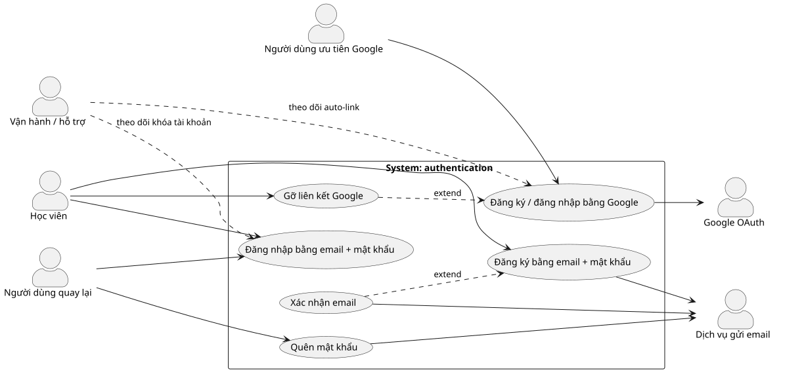

# authentication — Use Cases Index‍‌‌​​‌‌​​‌‌‌​‌‌‌‌​​‌​‌​‌‌‌‌‌​‌​​‌​​​‌​​​​‌​​​​‌​​​​​​​‌‌‌​‌‌​​​‌​​‌​​​​‌​​‌‌‌‌‌​​‌‌‌‌​‌‌‌​​​​​‌‌‌​​‌​‌‌‌‌​‌‌​​‌​‌‌​​​​​‌​‌‌​​‌‌​‌‍

## Use cases‍‌‌​​‌‌​​‌‌‌​‌‌‌‌​​‌​‌​‌‌‌‌‌​‌​​‌​​​‌​​​​‌​​​​‌​​​​​​​‌‌‌​‌‌​​​‌​​‌​​​​‌​​‌‌‌‌‌​​‌‌‌‌​‌‌‌​​​​​‌‌‌​​‌​‌‌‌‌​‌‌​​‌​‌‌​​​​​‌​‌‌​​‌‌​‌‍

> Bảng này là __ma trận truy vết per-feature__ (UC↔FR↔Screen↔Error↔OQ) đồng thời là metadata/lifecycle — 1 nguồn duy nhất, không tách file riêng. `/gap` mới soát orphan/link-lệch cross-doc (→ `docs/_shared/traceability.md`).

| # | Slug | Level | Status | Actor primary | Covers FR | Screens | Errors (E-*) | OQ ref | Priority | Updated |
|---|------|-------|--------|---------------|-----------|---------|--------------|--------|----------|---------|
| 1 | [uc-signup-email](uc-signup-email.md) | sea | draft | Học viên (đăng ký email) | FR-authentication-001, 002, 003, 004, 028, 029, 031 | signup, verify-sent | E-authentication-001, 002 | — | P0 | 2026-07-17 |
| 2 | [uc-verify-email](uc-verify-email.md) | sea | draft | Người dùng chưa xác nhận | FR-authentication-005, 006, 007 | verify-sent, verify-result-success, verify-result-expired | E-authentication-006, 007 | — | P0 | 2026-07-17 |
| 3 | [uc-login-email](uc-login-email.md) | sea | draft | Người dùng quay lại | FR-authentication-008, 009, 010, 011, 021, 022, 025, 026, 027 | login | E-authentication-003, 004, 005 | spec.md#OQ-3 | P0 | 2026-07-17 |
| 4 | [uc-google-oauth](uc-google-oauth.md) | sea | draft | Người dùng ưu tiên Google | FR-authentication-012, 013, 014, 015 | login | E-authentication-008 | spec.md#OQ-1 | P0 | 2026-07-17 |
| 5 | [uc-forgot-password](uc-forgot-password.md) | sea | draft | Người dùng quên mật khẩu | FR-authentication-016, 017, 018, 019, 020 | forgot-password, reset-password, reset-result-success | E-authentication-002, 009 | — | P0 | 2026-07-17 |
| 6 | [uc-unlink-google](uc-unlink-google.md) | sea | draft | Người dùng đã đăng nhập | FR-authentication-023, 024, 003 | account-security | E-authentication-010 | — | P0 | 2026-07-17 |

## CRUD matrix‍‌‌​​‌‌​​‌‌‌​‌‌‌‌​​‌​‌​‌‌‌‌‌​‌​​‌​​​‌​​​​‌​​​​‌​​​​​​​‌‌‌​‌‌​​​‌​​‌​​​​‌​​‌‌‌‌‌​​‌‌‌‌​‌‌‌​​​​​‌‌‌​​‌​‌‌‌‌​‌‌​​‌​‌‌​​​​​‌​‌‌​​‌‌​‌‍

> Use case nào thao tác entity nào (C=Create, R=Read, U=Update, D=Delete). Ô trống = không đụng. Nguồn edge UC→entity (OPERATES_ON) — đối chiếu với ERD (`srs/authentication-erd.md`). Entity đặt tên CamelCase khớp ERD.

| UC \ Entity | Account | Credential | LinkedProvider | VerificationToken | ResetToken | Session | LoginAttempt |
|---|---|---|---|---|---|---|---|
| [uc-signup-email](uc-signup-email.md) | CD | C | | C | | | |
| [uc-verify-email](uc-verify-email.md) | U | | | CRU | | | |
| [uc-login-email](uc-login-email.md) | RU | R | | | | CRUD | CRU |
| [uc-google-oauth](uc-google-oauth.md) | CRU | | CR | | | C | |
| [uc-forgot-password](uc-forgot-password.md) | R | U | | | CRU | RU | |
| [uc-unlink-google](uc-unlink-google.md) | R | CU | RD | | | | |‍‌‌​​‌‌​​‌‌‌​‌‌‌‌​​‌​‌​‌‌‌‌‌​‌​​‌​​​‌​​​​‌​​​​‌​​​​​​​‌‌‌​‌‌​​​‌​​‌​​​​‌​​‌‌‌‌‌​​‌‌‌‌​‌‌‌​​​​​‌‌‌​​‌​‌‌‌‌​‌‌​​‌​‌‌​​​​​‌​‌‌​​‌‌​‌‍

## Actors‍‌‌​​‌‌​​‌‌‌​‌‌‌‌​​‌​‌​‌‌‌‌‌​‌​​‌​​​‌​​​​‌​​​​‌​​​​​​​‌‌‌​‌‌​​​‌​​‌​​​​‌​​‌‌‌‌‌​​‌‌‌‌​‌‌‌​​​​​‌‌‌​​‌​‌‌‌‌​‌‌​​‌​‌‌​​​​​‌​‌‌​​‌‌​‌‍

| Actor | Loại | Mô tả | Nguồn |
|---|---|---|---|
| Học viên miễn phí / trả phí | primary | Người học tạo tài khoản, đăng nhập, đồng bộ tiến độ qua nhiều thiết bị | spec.md Mục 2 |
| Người dùng quay lại | primary | Đăng nhập lại; đặt lại mật khẩu khi quên | spec.md Mục 2 |
| Người dùng ưu tiên Google | primary | Đăng ký/đăng nhập một chạm bằng Google | spec.md Mục 2 |
| Google OAuth | system (ngoài) | Xác thực danh tính Google, trả email đã xác thực | spec.md Mục 2 |
| Dịch vụ gửi email (transactional) | system (ngoài) | Gửi email chứa link xác nhận + link đặt lại mật khẩu | spec.md Mục 2 |
| Bộ phận vận hành / hỗ trợ | secondary | Xử lý khiếu nại tài khoản khóa, theo dõi cảnh báo tự liên kết Google | spec.md Mục 2 |

## Diagram‍‌‌​​‌‌​​‌‌‌​‌‌‌‌​​‌​‌​‌‌‌‌‌​‌​​‌​​​‌​​​​‌​​​​‌​​​​​​​‌‌‌​‌‌​​​‌​​‌​​​​‌​​‌‌‌‌‌​​‌‌‌‌​‌‌‌​​​​​‌‌‌​​‌​‌‌‌‌​‌‌​​‌​‌‌​​​​​‌​‌‌​​‌‌​‌‍

## Relationships

| Type | From | To | Rationale |
|---|---|---|---|
| extend | uc-verify-email | uc-signup-email | Xác nhận email là bước tiếp nối sau đăng ký nhưng tách UC riêng vì có trigger độc lập (click link / resend) và có thể xảy ra muộn |
| extend | uc-unlink-google | uc-google-oauth | Gỡ liên kết chỉ áp dụng cho tài khoản đã liên kết Google; base OAuth vẫn đủ nghĩa nếu không gỡ |

## Nguồn dữ liệu

* FR + Error Matrix: [[../srs/authentication-spec.md|SRS spec]]
* Screens: [[../ascii-wireframe/authentication-wireframe-index.md|Screens index]]
* Open Questions: `srs/authentication-spec.md` Mục Open Questions (canonical — bảng trên chỉ trỏ ref `spec.md#OQ-N`)‍‌‌​​‌‌​​‌‌‌​‌‌‌‌​​‌​‌​‌‌‌‌‌​‌​​‌​​​‌​​​​‌​​​​‌​​​​​​​‌‌‌​‌‌​​​‌​​‌​​​​‌​​‌‌‌‌‌​​‌‌‌‌​‌‌‌​​​​​‌‌‌​​‌​‌‌‌‌​‌‌​​‌​‌‌​​​​​‌​‌‌​​‌‌​‌‍

<!-- wm:2b9af6c9b691879b1ddb7a04d29a1c88 -->
Tài liệu thuộc bộ AI4BA BA-Kit — bản quyền hoangphan.blog
