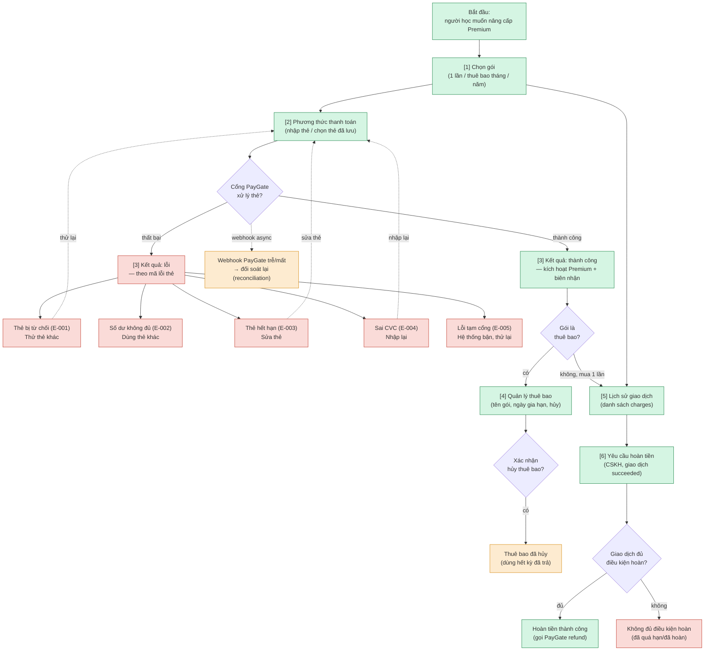

# premium-payment — User Flow‍‌‌​​‌‌​​‌‌‌​‌‌‌‌​​‌​‌​‌‌‌‌‌​‌​​‌​​​‌​​​​‌​​​​‌​​​​​​​‌‌‌​‌‌​​​‌​​‌​​​​‌​​‌‌‌‌‌​​‌‌‌‌​‌‌‌​​​​​‌‌‌​​‌​‌‌‌‌​‌‌​​‌​‌‌​​​​​‌​‌‌​​‌‌​‌‍

> Nguồn chia flow DUY NHẤT cho feature này. `/wireframe-ascii` và `/wireframe-html` đọc file này để biết flow nào gồm những màn nào — KHÔNG tự chia flow riêng.
>
> Derived từ `srs/premium-payment-spec.md` (FR/Error Matrix), `usecases/premium-payment-usecase-index.md` (4 UC), `integration/api-design.md` (orchestration PayGate + MailGate). Phủ happy / error / edge. Device chính: **desktop 1024** (responsive webapp).

## 1. User Flow (tổng)‍‌‌​​‌‌​​‌‌‌​‌‌‌‌​​‌​‌​‌‌‌‌‌​‌​​‌​​​‌​​​​‌​​​​‌​​​​​​​‌‌‌​‌‌​​​‌​​‌​​​​‌​​‌‌‌‌‌​​‌‌‌‌​‌‌‌​​​​​‌‌‌​​‌​‌‌‌‌​‌‌​​‌​‌‌​​​​​‌​‌‌​​‌‌​‌‍

> `[n]` = số màn hình đối chiếu Mục 2. Xanh = happy, đỏ = error, vàng = edge.

## 2. Danh sách màn hình‍‌‌​​‌‌​​‌‌‌​‌‌‌‌​​‌​‌​‌‌‌‌‌​‌​​‌​​​‌​​​​‌​​​​‌​​​​​​​‌‌‌​‌‌​​​‌​​‌​​​​‌​​‌‌‌‌‌​​‌‌‌‌​‌‌‌​​​​​‌‌‌​​‌​‌‌‌‌​‌‌​​‌​‌‌​​​​​‌​‌‌​​‌‌​‌‍

| [#] | Màn hình | Mục đích | Thuộc flow |
|-----|----------|----------|------------|
| 1 | plan-selection | Chọn gói one-time / thuê bao tháng / năm kèm giá; điểm vào mọi luồng thanh toán | buy-onetime, subscribe |
| 2 | payment-method | Nhập thẻ mới hoặc chọn thẻ đã lưu; lỗi thẻ E-003/E-004 | buy-onetime, subscribe |
| 3 | payment-result | Kết quả thanh toán: thành công (kích hoạt Premium + biên nhận) / lỗi (theo mã lỗi thẻ E-001..005) | buy-onetime |
| 4 | subscription-manage | Quản lý thuê bao: tên gói, trạng thái, ngày gia hạn, nút hủy | subscribe, manage-subscription |‍‌‌​​‌‌​​‌‌‌​‌‌‌‌​​‌​‌​‌‌‌‌‌​‌​​‌​​​‌​​​​‌​​​​‌​​​​​​​‌‌‌​‌‌​​​‌​​‌​​​​‌​​‌‌‌‌‌​​‌‌‌‌​‌‌‌​​​​​‌‌‌​​‌​‌‌‌‌​‌‌​​‌​‌‌​​​​​‌​‌‌​​‌‌​‌‍
| 5 | transaction-history | Danh sách giao dịch (list charges, phân trang); bấm xem chi tiết / tra trạng thái | manage-subscription, refund |
| 6 | refund-request | CSKH yêu cầu hoàn tiền 1 giao dịch đang succeeded | refund |

## 3. Chia flow‍‌‌​​‌‌​​‌‌‌​‌‌‌‌​​‌​‌​‌‌‌‌‌​‌​​‌​​​‌​​​​‌​​​​‌​​​​​​​‌‌‌​‌‌​​​‌​​‌​​​​‌​​‌‌‌‌‌​​‌‌‌‌​‌‌‌​​​​​‌‌‌​​‌​‌‌‌‌​‌‌​​‌​‌‌​​​​​‌​‌‌​​‌‌​‌‍

| Flow-slug | Tên flow | Màn hình gồm | Cases phủ |
|-----------|----------|--------------|-----------|
| buy-onetime | Mua Premium 1 lần | plan-selection → payment-method → payment-result | happy (thanh toán thành công, kích hoạt Premium FR-002/004/005), error (thẻ từ chối E-001, số dư E-002, hết hạn E-003, sai CVC E-004, lỗi cổng E-005), edge (webhook PayGate trễ → đối soát reconciliation) |
| subscribe | Đăng ký thuê bao | plan-selection → payment-method → subscription-manage | happy (tạo thuê bao thành công FR-007), error (thẻ lỗi như buy-onetime), edge (gia hạn tự động kỳ sau, thẻ hết hạn trước kỳ gia hạn) |
| manage-subscription | Quản lý / hủy thuê bao | subscription-manage → transaction-history | happy (xem trạng thái + hủy thuê bao FR-011), edge (hủy giữa kỳ → dùng hết kỳ đã trả, không hoàn phần còn lại) |
| refund | Hoàn tiền | transaction-history → refund-request | happy (CSKH hoàn tiền giao dịch succeeded FR-012), error (giao dịch không đủ điều kiện — đã quá hạn/đã hoàn E-006/009), edge (hoàn 1 phần vs toàn phần theo policy) |

## 4. Open Questions‍‌‌​​‌‌​​‌‌‌​‌‌‌‌​​‌​‌​‌‌‌‌‌​‌​​‌​​​‌​​​​‌​​​​‌​​​​​​​‌‌‌​‌‌​​​‌​​‌​​​​‌​​‌‌‌‌‌​​‌‌‌‌​‌‌‌​​​​​‌‌‌​​‌​‌‌‌‌​‌‌​​‌​‌‌​​​​​‌​‌‌​​‌‌​‌‍

- [ ] OQ-1 (kế thừa `spec.md`): chính sách hoàn tiền 1 phần (prorated) khi hủy thuê bao giữa kỳ — hiện mặc định "dùng hết kỳ đã trả, không hoàn phần còn lại", cần xác nhận với business.
- [ ] OQ-2: thời hạn cho phép yêu cầu hoàn tiền tính từ ngày giao dịch (vd 14/30 ngày) — ảnh hưởng điều kiện ở màn refund-request.‍‌‌​​‌‌​​‌‌‌​‌‌‌‌​​‌​‌​‌‌‌‌‌​‌​​‌​​​‌​​​​‌​​​​‌​​​​​​​‌‌‌​‌‌​​​‌​​‌​​​​‌​​‌‌‌‌‌​​‌‌‌‌​‌‌‌​​​​​‌‌‌​​‌​‌‌‌‌​‌‌​​‌​‌‌​​​​​‌​‌‌​​‌‌​‌‍

<!-- wm:2b9af6c9b691879b1ddb7a04d29a1c88 -->
Tài liệu thuộc bộ AI4BA BA-Kit — bản quyền hoangphan.blog
