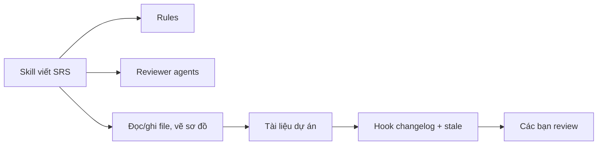

# 02 — Bộ Kit gồm những gì, và sửa ở đâu‍‌‌​​‌‌​​‌‌‌​‌‌‌‌​​‌​‌​‌‌‌‌‌​‌​​‌​​​‌​​​​‌​​​​‌​​​​​​​‌‌‌​‌‌​​​‌​​‌​​​​‌​​‌‌‌‌‌​​‌‌‌‌​‌‌‌​​​​​‌‌‌​​‌​‌‌‌‌​‌‌​​‌​‌‌​​​​​‌​‌‌​​‌‌​‌‍

> Các các bạn chạy một skill, nó ghi ra file. Ổn.
>
> Rồi các bạn muốn nó ghi khác đi một chút — đổi template, bỏ một câu hỏi thừa, thêm một rule của team. Mở thư mục `.claude/` ra thì thấy sáu loại thư mục, không biết sửa cái nào.
>
> Chương này gỡ đúng chỗ đó. __Phần 1__ là bản đồ tổng thể, đọc một lần là đủ. __Phần 2__ là cách đọc file skill, quay lại tra khi cần sửa.

***

## Phần 1 — Sáu thành phần của bộ Kit‍‌‌​​‌‌​​‌‌‌​‌‌‌‌​​‌​‌​‌‌‌‌‌​‌​​‌​​​‌​​​​‌​​​​‌​​​​​​​‌‌‌​‌‌​​​‌​​‌​​​​‌​​‌‌‌‌‌​​‌‌‌‌​‌‌‌​​​​​‌‌‌​​‌​‌‌‌‌​‌‌​​‌​‌‌​​​​​‌​‌‌​​‌‌​‌‍

Hãy hình dung một nhóm làm dự án nhỏ. Trong nhóm đó có:

| Thành phần | Nó là ai trong nhóm | Trong bộ Kit nằm ở |
|---|---|---|
| __Skill__ | Bản quy trình cho một việc cụ thể | `.claude/skills/<tên>/SKILL.md` |
| __Agent__ | Người chuyên soi một góc nhìn | `.claude/agents/<tên>.md` |
| __Rule__ | Nội quy ai cũng phải giữ, mọi lúc | `.claude/rules/<tên>.md` |
| __Hook__ | Việc tự chạy khi có sự kiện | `.claude/hooks/<tên>.sh` |
| __Script / Engine__ | Máy móc chuyên dụng | `_scripts/`, `.claude/scripts/`, `skills/*/engine/` |
| __Settings__ | Bảng phân quyền của nhóm | `.claude/settings.json` |

Và hai thư mục nữa không nằm trong `.claude/` nhưng quan trọng ngang:

| | Nó là gì |
|---|---|
| `_templates/` | Khung file mẫu — skill điền nội dung vào đây |
| `docs/` | __Nơi skill ghi ra__ — tài liệu thật của dự án các bạn |

***

### `.claude/` và `docs/` khác nhau thế nào‍‌‌​​‌‌​​‌‌‌​‌‌‌‌​​‌​‌​‌‌‌‌‌​‌​​‌​​​‌​​​​‌​​​​‌​​​​​​​‌‌‌​‌‌​​​‌​​‌​​​​‌​​‌‌‌‌‌​​‌‌‌‌​‌‌‌​​​​​‌‌‌​​‌​‌‌‌‌​‌‌​​‌​‌‌​​​​​‌​‌‌​​‌‌​‌‍

Đây là chỗ người mới hay lẫn. Nhớ một câu: **`.claude/` là nơi skill SỐNG, `docs/` là nơi skill GHI RA.**

```text
.claude/        = NƠI SKILL SỐNG (các bạn sửa khi muốn đổi CÁCH LÀM VIỆC)
   ├── skills/     từng skill
   ├── agents/     chuyên gia phụ
   ├── rules/      luật dùng chung
   ├── hooks/      script tự chạy
   ├── scripts/    công cụ hỗ trợ
   └── settings.json

_templates/     = khung file mẫu

docs/           = NƠI SKILL GHI RA (các bạn sửa khi muốn đổi NỘI DUNG TÀI LIỆU)
   ├── {feature}/  tài liệu của từng feature
   ├── _shared/    định nghĩa và quy ước dùng chung  ← đây là NGUỒN, không phải rác
   └── design.md   design token để skill đọc          ← cũng là NGUỒN
```

Lưu ý quan trọng: `docs/_shared/` và `docs/design.md` __là dữ liệu đầu vào__, không phải file tạm. Sửa hai chỗ này là sửa dữ liệu dự án. Ví dụ muốn đổi thuật ngữ toàn dự án, các bạn sửa `docs/_shared/definitions.md` một lần, không sửa từng feature.

***

### Skill — bản quy trình cho một việc‍‌‌​​‌‌​​‌‌‌​‌‌‌‌​​‌​‌​‌‌‌‌‌​‌​​‌​​​‌​​​​‌​​​​‌​​​​​​​‌‌‌​‌‌​​​‌​​‌​​​​‌​​‌‌‌‌‌​​‌‌‌‌​‌‌‌​​​​​‌‌‌​​‌​‌‌‌‌​‌‌​​‌​‌‌​​​​​‌​‌‌​​‌‌​‌‍

Skill là thành phần các bạn dùng nhiều nhất. Mỗi skill là một thư mục chứa file `SKILL.md`.

Gọi nó bằng cách gõ `/tên-skill`. Ví dụ `/srs authentication`.

Skill khác prompt ở chỗ nó không chỉ có câu lệnh. Nó có bối cảnh phải đọc, rule phải giữ, format đầu ra, và điểm phải dừng hỏi lại. Phần 2 của chương này mổ xẻ kỹ.

Một số skill không gọi được bằng lệnh (`user-invocable: false`) — đó là __skill nền__, chỉ tồn tại để skill khác nạp vào khi cần. Chúng không chiếm chỗ trong danh sách lệnh của các bạn.

***

### Agent — người soi một góc nhìn‍‌‌​​‌‌​​‌‌‌​‌‌‌‌​​‌​‌​‌‌‌‌‌​‌​​‌​​​‌​​​​‌​​​​‌​​​​​​​‌‌‌​‌‌​​​‌​​‌​​​​‌​​‌‌‌‌‌​​‌‌‌‌​‌‌‌​​​​​‌‌‌​​‌​‌‌‌‌​‌‌​​‌​‌‌​​​​​‌​‌‌​​‌‌​‌‍

Agent là một "nhân vật" có chuyên môn hẹp, được gọi ra để review. Nó chạy trong __phiên riêng__ với context riêng, rồi trả về findings.

Bộ này có các agent như:

| Agent | Nó soi cái gì |
|---|---|
| `senior-ba` | Còn thiếu gì, edge case nào bỏ sót, chỗ nào mơ hồ |
| `qa-reviewer` | AC có test được không, coverage thiếu chỗ nào |
| `uxui-reviewer` | Màn hình thiếu trạng thái nào (loading/empty/error) |
| `flow-reviewer` | Luồng có nhánh cụt không, case error/edge đã phủ chưa |
| `tech-reviewer` | Làm được không, tốn kém thế nào, rủi ro bảo mật |

Vì sao phải chạy phiên riêng? Vì nếu để cùng một AI vừa viết vừa tự review, nó có xu hướng bảo vệ cái nó vừa viết. Agent riêng đọc lại từ đầu bằng con mắt khác.

Điểm cần nhớ: __findings của agent là gợi ý để các bạn xem, không phải kết luận cuối cùng.__

***

### Rule — nội quy giữ ở mọi lần chạy

Skill nói *làm việc này thế nào*. Rule nói *điều gì luôn đúng bất kể đang làm việc gì*.

Ví dụ vài rule trong bộ này:

| Rule | Nó giữ điều gì |
|---|---|
| `approval-gate.md` | AI phải hỏi trước khi ghi file. Ba cổng L1/L2/L3 |
| `ba-conventions.md` | Không hỏi lại câu các bạn đã trả lời. Không hỏi bằng ngôn ngữ dev |
| `naming-conventions.md` | File đặt tên thế nào, ID đánh số ra sao |
| `feature-bootstrap.md` | Gặp feature chưa tồn tại thì xử lý thế nào |
| `diagram-correctness.md` | Sơ đồ phải đúng ngữ pháp, không chỉ ra được ảnh |

Rule được nhiều skill dùng chung. Đó là lý do khi copy một skill về dự án, các bạn phải copy kèm rule mà nó tham chiếu — thiếu rule thì skill chạy nhưng hành xử sai.

***

***

### Ba cổng duyệt L1 / L2 / L3 — cái các bạn gặp mọi lần chạy

Đây là rule quan trọng nhất trong cả bộ. Quan trọng hơn hook, script và settings cộng lại, vì các bạn gặp nó ở __mọi lần chạy skill__:

| Cổng | Khi nào | Các bạn thấy gì |
|---|---|---|
| __L1 — Plan__ | Trước khi ghi bất kỳ file nào | Danh sách file sắp tạo/sửa + tóm tắt nội dung. Các bạn trả lời Y / n / chọn từng cái |
| __L2 — Diff__ | Khi sửa file đã tồn tại | Phần thay đổi cụ thể (dòng thêm/bớt). Các bạn duyệt trước khi ghi đè |
| __L3 — Iterate__ | Với output sáng tạo xem được trong chat (ASCII wireframe) | Bản nháp hiện ra, các bạn nói "sửa chỗ này" tối đa 3 vòng |

Ý nghĩa thực tế: __AI không tự ghi file sau lưng các bạn.__ Đây là chỗ giữ chất lượng, và cũng là lý do bộ này không tự chạy end-to-end.

> __Nhưng nói cho rõ:__ L1/L2/L3 là __luật viết trong file rule__, không phải hàng rào kỹ thuật của Claude Code. Model đọc luật đó rồi tuân theo — nghĩa là nó đáng tin đúng bằng mức model chịu nghe lời. Skill trong bộ này tuân khá tốt, nhưng đừng coi đó là bảo đảm tuyệt đối.
>
> Muốn chặn cứng ở tầng hệ thống thì phải dùng `permissions` trong `.claude/settings.json` (chỉ cho ghi vào thư mục nào), hoặc hook chặn-trước-khi-ghi. Xem mục Settings bên dưới.

***

### Hook — việc tự chạy khi có sự kiện

Hook không phải AI. Nó là script chạy tự động khi có sự kiện xảy ra.

| Hook | Chạy khi | Làm gì |
|---|---|---|
| `session-init` | Mở phiên chat mới | In tình trạng dự án: bao nhiêu tài liệu draft, bao nhiêu CR đang mở |
| `auto-changelog` | Sau khi ghi/sửa file | Ghi một dòng vào nhật ký thay đổi |
| `post-edit-stale` | Sau khi sửa file | Đánh dấu tài liệu phía sau là "có thể đã lỗi thời" |
| `status-transition` | Khi trạng thái tài liệu đổi | Gợi ý bước tiếp theo |

Hook giải quyết vấn đề rất thật: các bạn sửa SRS xong, quên mất user story phía sau cũng cần xem lại. Hook đánh dấu hộ.

Hook được khai báo trong `.claude/settings.json`. Copy file hook về mà quên khai báo thì nó nằm im.

***

### Script / Engine — máy móc chuyên dụng

Một số việc AI không nên tự làm bằng tay vì dễ sai:

| Công cụ | Dùng cho |
|---|---|
| `mermaid-verify.mjs` | Kiểm sơ đồ Mermaid có lỗi cú pháp/ngữ nghĩa không |
| `puml-usecase-lint.mjs` | Kiểm use case diagram đúng ngữ pháp UML |
| `bpmn/engine/` | Sinh file BPMN chuẩn OMG + tự dàn trang |‍‌‌​​‌‌​​‌‌‌​‌‌‌‌​​‌​‌​‌‌‌‌‌​‌​​‌​​​‌​​​​‌​​​​‌​​​​​​​‌‌‌​‌‌​​​‌​​‌​​​​‌​​‌‌‌‌‌​​‌‌‌‌​‌‌‌​​​​​‌‌‌​​‌​‌‌‌‌​‌‌​​‌​‌‌​​​​​‌​‌‌​​‌‌​‌‍
| `_scripts/build-preview.py` | Gộp tài liệu markdown thành một file HTML xem được |

Đây là lý do bộ này không chỉ là "prompt viết kỹ". Có những thứ phải kiểm bằng máy — vì __sơ đồ sai ngữ pháp vẫn render ra ảnh đẹp__, mắt người nhìn không ra.

Một số engine cần cài `npm ci` trước khi dùng. Chương [01](01-bat-dau-nhanh.md) có hướng dẫn.

***

### Settings — bảng phân quyền

`.claude/settings.json` khai báo hai thứ chính:

__Quyền__ — skill được làm gì, không được làm gì:

```json
"permissions": {
  "allow": ["Bash(git:*)", "Read(*)", "Edit(docs/**)"],
  "deny":  ["Edit(.git/**)"]
}
```

__Hook__ — script nào chạy ở sự kiện nào.

> __Đừng copy đè file này__ khi mang skill về dự án có sẵn. Hãy mở cả hai file ra và gộp thủ công phần các bạn cần — đè lên sẽ xoá mất cấu hình cũ của dự án.

***

### Năm lớp phối hợp với nhau thế nào

Một ví dụ thật: các bạn chạy skill viết SRS.



Skill dùng __tool__ để đọc brainstorm và PRD. Nó theo __rule__ nên không tự quyết chính sách đặt cọc — chỗ nào chưa rõ thì ghi open question. Sau khi file được ghi, __hook__ ghi changelog và đánh dấu user story liên quan cần xem lại. Một __agent__ review quét thêm gap. Nhưng __các bạn__ vẫn là người chốt.

Điều quan trọng là đừng lẫn lộn các lớp. Thêm một prompt hay không tự tạo ra review gate. Có agent review cũng không có nghĩa agent hiểu policy chưa từng được ghi trong tài liệu.

***

## Phần 2 — Đọc một file SKILL.md

Giờ mở một file skill ra. Cấu trúc luôn theo thứ tự này:

```markdown
---
name: erd
description: Dùng khi cần vẽ Entity-Relationship Diagram (Mermaid) cho data model
  của 1 feature.
allowed-tools: Read, Write, Edit, Bash, Glob, Grep
user-invocable: true
argument-hint: "[--feature <slug>]"
---

# /erd — Entity Relationship Diagram

## Goal
## Constraints
    ### Hard rules — never violate
    ### Pitfalls — check before you act
## Inputs
## Context (dynamic)
## Approach
## References
```

Đọc theo thứ tự trên xuống. Mỗi phần trả lời một câu hỏi khác nhau, và __AI đọc chúng ở những thời điểm khác nhau__ — đây là điểm mấu chốt để hiểu skill.

***

### Frontmatter — phần giữa hai dấu `---`

Đây là __metadata__: thông tin về skill, không phải nội dung skill.

| Trường | Nghĩa | AI đọc khi nào |
|---|---|---|
| `name` | Tên skill = lệnh gọi `/erd` | __Mọi phiên chat__ |
| `description` | Khi nào dùng skill này | __Mọi phiên chat__ ⚠️ |
| `allowed-tools` | Skill được phép làm gì | Khi gọi skill |
| `user-invocable` | `true` = gõ lệnh gọi được | Lúc dựng danh sách lệnh |
| `disable-model-invocation` | `true` = AI không tự gọi, chỉ chạy khi các bạn gõ lệnh. Không bắt buộc phải có — trong bộ này khoảng một nửa số skill bật | __Quyết định skill có nằm trong danh sách preload không__ |
| `argument-hint` | Gợi ý tham số | Khi các bạn gõ lệnh |

⚠️ `name` + `description` của những skill __mà model được phép tự gọi__ sẽ được nạp vào __mọi phiên chat__, kể cả khi các bạn không dùng tới. Skill khai `disable-model-invocation: true` thì không nằm trong danh sách đó.

Đây là lý do đừng cài nhiều skill — [chương 04](04-skill-preload-va-token.md) có con số cụ thể và cách đo.

`allowed-tools` đáng để ý khi các bạn lo về an toàn: skill nào chỉ có `Read, Grep, Glob` là read-only, không ghi được gì. Skill có `Write, Edit` mới sửa file được.

***

### Goal — skill này làm gì

Một đoạn ngắn nói mục tiêu và ranh giới. AI đọc __ngay khi skill được gọi__, để định hướng toàn bộ phần còn lại.

Đây cũng là chỗ các bạn đọc đầu tiên khi muốn biết skill có hợp việc mình không.

***

### Constraints — luật của skill

Phần dài nhất và quan trọng nhất. Chia __hai mức__ có chủ đích:

**`Hard rules — never violate`** — luật cứng. Vi phạm là sai, không có ngoại lệ. Ví dụ thật từ `/erd`:

```markdown
- **1 output cố định** — `docs/{feature}/srs/{feature}-erd.md`.
- **L1 approval** trước Write.
- **KHÔNG L3 iterate** — mermaid không render trong chat nên iterate vô nghĩa.
- **File đã tồn tại** → tự động chuyển sang update mode (L2 diff), không refuse.
```

**`Pitfalls — check before you act`** — chỗ dễ sai, cần kiểm. Không phải cấm, mà là cảnh báo dựa trên lỗi từng gặp thật:

```markdown
- **Mỗi attribute BẮT BUỘC đúng 2 token `type name`** — chỉ ghi `name` sẽ parse fail.
- **Cardinality tricky** — nhớ thứ tự: `LEFT ||--o{ RIGHT` đọc là "1 LEFT có nhiều RIGHT".
- **Long entity names** — render xấu nếu >15 ký tự.
```

Vì sao tách hai mức? Vì khi AI phải cân nhắc đánh đổi, nó cần biết cái nào __tuyệt đối không được phá__ và cái nào __chỉ cần cẩn thận__. Gộp chung thành một danh sách dài thì mọi thứ trông ngang nhau, và luật quan trọng bị chìm.

> Khi các bạn tùy biến skill, đây là phần sửa nhiều nhất. Các bạn thấy AI lặp lại một lỗi? Thêm một dòng vào Pitfalls. Các bạn có quy định team bắt buộc? Thêm vào Hard rules.

***

### Inputs — skill cần gì để chạy

Liệt kê tham số và tài liệu đầu vào. Ví dụ: `/erd` cần `--feature <slug>`, và đọc SRS của feature đó nếu có.

Phần này cho biết __thứ tự chạy skill__: nếu Inputs của skill B là output của skill A, thì phải chạy A trước.

***

### Context (dynamic) — vì sao gọi là "động"

Đây là phần đặc biệt nhất, và cũng hay gây thắc mắc nhất.

Nhìn một ví dụ thật:

```markdown
## Context (dynamic)

Today: !`date +%Y-%m-%d`
Features có SRS: !`for d in docs/*/srs/*-spec.md; do ... done`
Features có US: !`for d in docs/*/userstories/; do ... done`
```

Ký hiệu `` !`lệnh` `` nghĩa là: __chạy lệnh này rồi chèn kết quả vào__.

Vì sao cần? Vì skill là file tĩnh, nhưng dự án của bạn thì thay đổi liên tục. Hôm nay các bạn có 3 feature, tuần sau có 7. Nếu viết cứng danh sách feature vào skill thì tuần sau nó sai.

Phần này chạy __ngay trước khi AI đọc Approach__ — nghĩa là AI luôn nhìn thấy tình trạng thật của dự án tại thời điểm chạy, chứ không phải tình trạng lúc skill được viết.

Nhờ vậy skill làm được những việc như:

* Các bạn gõ `/userstory` không kèm tham số → skill biết dự án có những feature nào mà đưa danh sách cho các bạn chọn
* Skill biết feature nào đã có SRS, feature nào chưa → cảnh báo nếu các bạn chạy sai thứ tự
* Ngày tháng luôn đúng hôm nay, không phải hardcode

> Đây là chỗ hay phải sửa nhất khi mang skill sang dự án có cấu trúc thư mục khác. Nếu tài liệu của các bạn không nằm ở `docs/{feature}/` thì mấy lệnh này trả về rỗng.

***

### Approach — các bước thực hiện

Quy trình từng bước, thường chia theo Phase. Đây là phần AI bám theo khi làm việc thật.

Đọc phần này các bạn sẽ biết chính xác skill sẽ hỏi mình cái gì, ở bước nào, và ghi file lúc nào.

***

### References — skill này dựa vào cái gì

Danh sách rule, template, agent, script mà skill tham chiếu. Ví dụ:

```markdown
## References
- @.claude/rules/approval-gate.md
- @.claude/rules/ba-conventions.md
- @_templates/diagram-erd.md
```

__Đây là danh sách dependency.__ Khi copy skill sang dự án khác, các bạn phải copy kèm những file này. Chương [06](06-copy-skill-ve-du-an.md) có prompt để AI dò hộ — kể cả dependency lồng nhau.

***

### Khi nào AI đọc phần nào

Chỉ có __hai thời điểm__:

* __Mọi phiên chat__ — chỉ `name` + `description` (và chỉ của skill mà model được phép tự gọi). Đây là chỗ tốn token cố định, xem [chương 04](04-skill-preload-va-token.md).
* __Khi skill được gọi__ — Claude Code chạy các lệnh động rồi đưa __toàn bộ file__ vào một lượt. Không có chuyện đọc Goal xong mới đọc Constraints.

Rule và template được nạp khi skill tham chiếu tới. Agent chỉ chạy khi skill gọi ra. Hook chạy sau khi file được ghi.

***

## Ngại đọc file dài?

Nhờ AI đọc hộ — [chương 01](01-bat-dau-nhanh.md) có sẵn prompt giải thích một skill, kèm câu bắt nó trích dẫn file làm bằng chứng.

***

## Tóm tắt

* Sáu thành phần: __skill__ (quy trình), __agent__ (người soi), __rule__ (nội quy), __hook__ (tự chạy), __script__ (máy móc), __settings__ (phân quyền).
* `.claude/` là nơi skill __sống__; `docs/` là nơi skill __ghi ra__. `docs/_shared/` và `docs/design.md` là __nguồn đầu vào__, không phải file tạm.
* Ba cổng duyệt __L1__ (kế hoạch) / __L2__ (diff) / __L3__ (nháp) — AI không ghi file sau lưng các bạn.
* Đọc SKILL.md theo thứ tự: __Goal → Constraints → Inputs → Context → Approach → References__.
* __Constraints chia hai mức__: `Hard rules` là luật cứng, `Pitfalls` là chỗ dễ sai.
* __Context (dynamic)__ chạy lệnh thật lúc gọi skill — nên skill luôn thấy tình trạng dự án hiện tại. Đây là chỗ hay phải sửa khi đổi cấu trúc thư mục.
* __References__ chính là danh sách dependency khi copy skill đi nơi khác.

***

Chương tiếp: [03 — Chọn pipeline của bạn](03-chon-pipeline-cua-ban.md)‍‌‌​​‌‌​​‌‌‌​‌‌‌‌​​‌​‌​‌‌‌‌‌​‌​​‌​​​‌​​​​‌​​​​‌​​​​​​​‌‌‌​‌‌​​​‌​​‌​​​​‌​​‌‌‌‌‌​​‌‌‌‌​‌‌‌​​​​​‌‌‌​​‌​‌‌‌‌​‌‌​​‌​‌‌​​​​​‌​‌‌​​‌‌​‌‍


<!-- wm:2b9af6c9b691879b1ddb7a04d29a1c88 -->
<sub>Tài liệu thuộc bộ AI4BA BA-Kit — bản quyền hoangphan.blog</sub>
